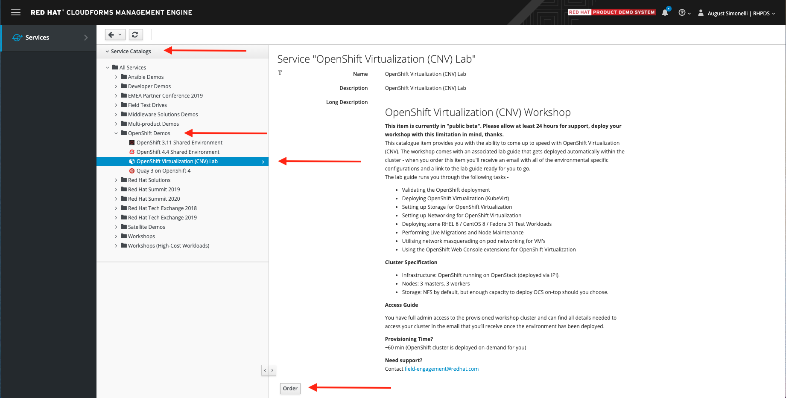
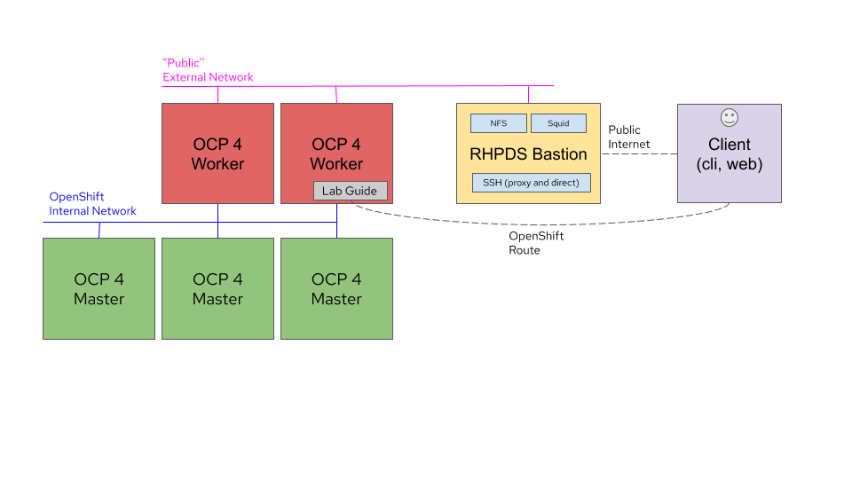

# OpenShift Virtualization Hands-on Lab (RHPDS)

**Authors**: [Rhys Oxenham](mailto:roxenham@redhat.com) and [August Simonelli](mailto:asimonel@redhat.com)

## Welcome!

Welcome to our hands-on OpenShift Virtualization lab for the Red Hat Product Demo System (RHPDS) self-service environment. 

> **NOTE**: We also have a branch that can be used on your own hardware which includes deployment scripts for a completely self-contained training. This is available from the [main branch of this lab's repo](https://github.com/RHFieldProductManagement/openshift-virt-labs/tree/master).

## Ordering your lab environment

Labs are ordered from within the [Red Hat Product Demo System (RHPDS)](https://rhpds.redhat.com/catalog/explorer) environment. Once you login to RHPDS go to **Service Catalogs > OpenShift Demos** and choose **OpenShift Virtualization (CNV) Lab**:

    

Select **Order** to request your lab.

You need to have an existing account to access this environment.

## Accessing your lab environment

Once you launch your lab from within RHPDS, you will then receive three automated progress emails while your lab environment is prepared. 

After about an hour the **third email** arrives and it indicates the build is done and contains access details.

To access the lab simply follow the **CNV Lab Workbook** link. From there you will find all details to undertake the lab.

    

> **NOTE**: There are other important details in the email **so do not delete it**! When needed you will reference it via instruction from within the lab guide.

## Lab environment

The lab includes a self-hosted OpenShift Virtualization environment and a hands-on self-paced lab guide utilizing [OpenShift homeroom](https://github.com/openshift-homeroom).

The lab content is presented within your browser in three easy to use sections consisting of the following sections: navigation, lab steps, and working environment. 

Through this browser-based environment you'll have access to an OpenShift CLI environment *as well as* the OpenShift UI (console).

All labs steps are run from *within* this fully-contained browser based environment.

### Lab architecture 

The entire setup is contained within infrastructure provided by RHPDS. All you need to do is Order the lab and access the CNV Workbook Link!

The deployment is visualised as follows:

    

> **REMINDER**: **Within this environment you can access all aspects of the lab through the deployed lab guide which is available via the CNV Workbook Link in the RHPDS email.**

> **NOTE**: For the purposes of this repo and the labs themselves, any reference to "CNV," "Container-native Virtualization," "OpenShift Virtualization," and "KubeVirt" can be used interchangeably.

# Contributing

**We very much welcome contributions and pull requests! And if you have any questions please reach out directly to us at field-engagement@redhat.com**
