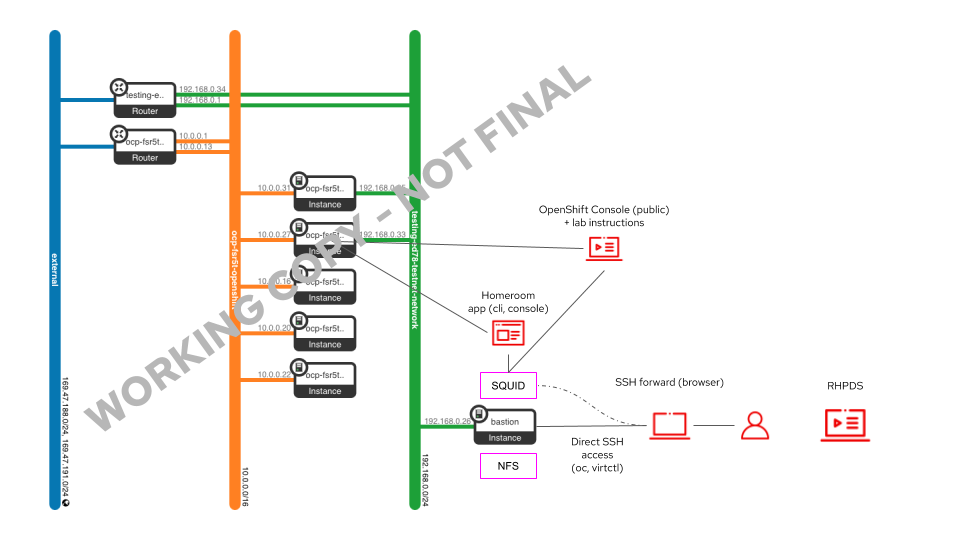
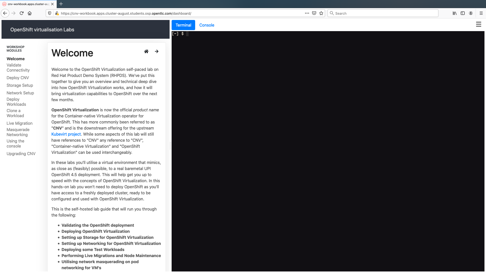

## OpenShift Virtualization Hands-on Lab (RHPDS)

**Authors**: [Rhys Oxenham](mailto:roxenham@redhat.com) and [August Simonelli](mailto:asimonel@redhat.com)

## **PLEASE NOTE THIS LAB IS UNDER DEVELOPEMENT AND IS NOT YET AVAILABLE FOR USE IN RHPDS.**

Welcome to our hands-on OpenShift Virtualization lab in RHPDS.

The lab INCLUDES a self-hosted OpenShift Virtualization hands-on self-paced lab guide based on [OpenShift homeroom](https://github.com/openshift-homeroom) - this guide will introduce you to using the lab from within RHPDS.

We also have a branch that can be used on your own hardware which includes deployment scripts for a completely self-contained training. This is available from the [main branch of this lab's repo](https://github.com/RHFieldProductManagement/openshift-virt-labs/tree/master).

We are going to use the official Red Hat downstream components, where **OpenShift Virtualization** is now the official feature name of the packaged up [Kubevirt project](https://kubevirt.io/) within the OpenShift product. 

Please note: For the purposes of this repo and the labs themselves, any reference to "CNV", "Container-native Virtualization" and "OpenShift Virtualization", and "KubeVirt" can be used interchangeably.

The lab guide runs you through the following tasks -

* **Validating the OpenShift deployment**
* **Deploying OpenShift Virtualization (KubeVirt)**
* **Setting up Storage for OpenShift Virtualization**
* **Setting up Networking for OpenShift Virtualization**
* **Deploying Test Workloads**
* **Cloning Workloads**
* **Performing Live Migrations and Node Maintenance**
* **Utilising pod networking for VM's**
* **Using the OpenShift Web Console extensions for OpenShift Virtualization**

### The Environment

As mentioned above, the entire setup is based on a virtualised infrastructure provided by RHPDS. This means that the OpenShift masters and workers are virtual machines themselves, and we run any OpenShift Virtualization virtual machines as nested guests. 

We do this for simplicity and for ease of scaling this type of enablement however at this time OpenShift Virtualization does not support nested virtualization so you cannot recommend this to customers.

The deployment is visualised as follows:

    

The lab is deployment inside of RHPDS on topn of OpenStack. A user requests the lab from RHPDS and will be given two ways to access:

* using the CLI on a bastion host running RHEL 7 and the publically available OpenShift Console
* via a fully OpenShift-hosted integrated CLI and Console enviroment

The bastion host is critical to the deployment for a number of reasons; it provides the following services:

* An **NFS** server to provide access to shared storage for our `persistent volume claims` when we wish to deploy virtual machines on OpenShift Virtualization.
*
* A **squid** proxy server so we can point our client browser to the bastion and get all of the required network access we require to the lab, including terminals, OpenShift web-consoles, and access to any additional applications we deploy through their routes.
*
* A public **jump** server to connect to the rest of our infrastructure containing `oc` and `virtctl` commands and access

### Getting Started

Setup an SSH tunnel to the bastion machine so we can leverage the **squid** proxy server to *easily* access the extra network. You can also use this connection to access the public OpenShift conscole, the hosted lab guide, and any other OpenShift routes that may be internal to RHPDS only. From your workstation, to bastion host  and enable a port forward **from your local machine** to the bastion's private IP address. You may need to login to the machine with your RHPDS credentials and issue an `ip a` command to see the IP (in the example below it is 192.168.47.16).

~~~bash
$ $ ssh lab-user@bastion.{{ GUID }}.students.osp.opentlc.com -L 8080:192.168.47.16:3128
~~~

This creates a port forward to the squid running on the basition (on 3128) from your local machine's port 8080.

Once this is up and running, set your browser (we've tested Firefox and had the most success with this - your mileage may vary with other browsers) to use **localhost:8080** for all protocols, and make sure you enable ***DNS over SOCKSv5*** - this avoids any challenges with local DNS:

If all has been well, you can open up the lab guide from your browser that has the proxy server enabled, the URL you need to navigate to is: 

https://cnv-workbook.apps.cluster-*GUID*.students.osp.opentlc.com/

> **NOTE**: The email from RHPDS will supply this link as well if you don't know your GUID and cluster name.

After a few self-signed certificate approvals you should see the following self-hosted lab guide running on the cluster you just deployed:

> **NOTE**: The terminal on the right hand side is already pre-configured with the necessary credentials to access the underlying OpenShift cluster, as is the OpenShift Web Console if you select the button above the terminals.

If you want to access the environment outside of the hosted lab guide you can also use the bastion host as it has all of the necessary credentials setup. 

Furthermore, this is the only node you'll be able to connect to the OpenShift nodes from as it's the one we used to run the installation and therefore the ssh-key has already been imported, for example:

Good luck and let us know if you have any questions/challenges... :-)

### Contributing

**We very much welcome contributions and pull requests!**
