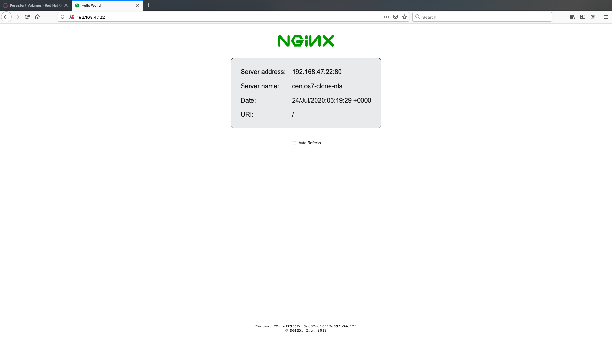
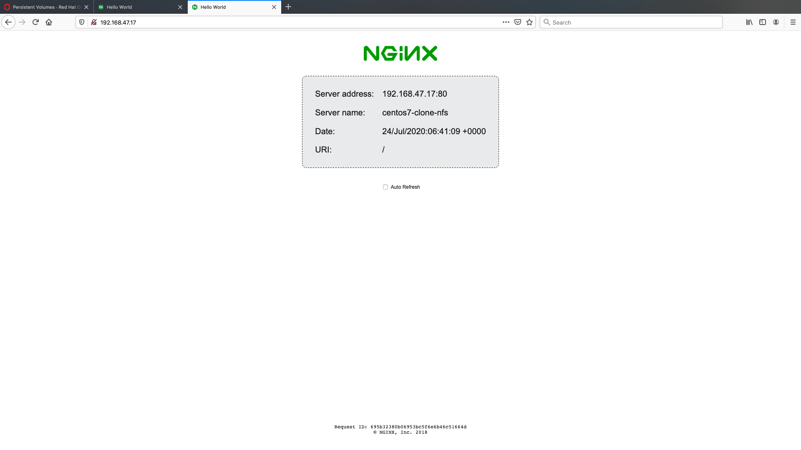

In this lab we're going to clone a workload and prove that it's identical to the previous. For fun, we will use a Centos 7 image for this work. We're going to download and customise the image, launch a virtual machine via OpenShift Virtualization based on it, and then clone it - we'll then test to see if the cloned machine works as expected. 

Let's begin by checking we have a availale PV for this work:

~~~bash
$ oc get pv
NAME                                       CAPACITY   ACCESS MODES   RECLAIM POLICY   STATUS      CLAIM                                             STORAGECLASS           REASON   AGE
nfs-pv1                                    10Gi       RWO,RWX        Delete           Bound       default/centos8-nfs                               nfs                             55m
nfs-pv2                                    10Gi       RWO,RWX        Delete           Available                                                     nfs                             50m
pvc-11b35321-1aa4-4723-a436-66591f81417c   100Gi      RWO            Delete           Bound       openshift-image-registry/image-registry-storage   standard                        4h51m
pvc-e2f75a46-7402-4bc6-ac30-acce7acd9feb   29Gi       RWO            Delete           Bound       default/centos8-hostpath                          hostpath-provisioner            147m
~~~

You should have a PV (likely nfs-pv2, but it doesn't have to be) marked as `Available`.

Next we will create a PVC for that PV that utilises the CDI utility to import a Centos 7 image (from http://cloud.centos.org/centos/7/images/CentOS-7-x86_64-GenericCloud.qcow2). The syntax should be familiar to you now with the `cdi.kubevirt.io/storage.import.endpoint` annotation indicating the endpoint for CDI to import from.

~~~bash
$ cat << EOF | oc apply -f -
apiVersion: v1
kind: PersistentVolumeClaim
metadata:
  name: "centos7-clone-nfs"
  labels:
    app: containerized-data-importer
  annotations:
    cdi.kubevirt.io/storage.import.endpoint: "http://cloud.centos.org/centos/7/images/CentOS-7-x86_64-GenericCloud.qcow2"
spec:
  volumeMode: Filesystem
  storageClassName: nfs
  accessModes:
  - ReadWriteMany
  resources:
    requests:
      storage: 10Gi
EOF

persistentvolumeclaim/centos7-clone-nfs created
~~~

As before we can watch the process and see the pods:

~~~bash
$ oc get pods
NAME                                          READY   STATUS    RESTARTS   AGE
importer-centos7-clone-nfs                    1/1     Running   0          5s
virt-launcher-centos8-server-hostpath-zpgwr   1/1     Running   0          35m
virt-launcher-centos8-server-nfs-5d8zd        1/1     Running   0          42m
~~~

Be fast!

~~~bash
$ oc logs -f importer-centos7-clone-nfs
I0721 05:54:57.926925       1 importer.go:51] Starting importer
I0721 05:54:57.927727       1 importer.go:107] begin import process
I0721 05:54:58.090877       1 data-processor.go:275] Calculating available size
I0721 05:54:58.094471       1 data-processor.go:283] Checking out file system volume size.
I0721 05:54:58.094909       1 data-processor.go:287] Request image size not empty.
I0721 05:54:58.094940       1 data-processor.go:292] Target size 10Gi.
I0721 05:54:58.096037       1 util.go:37] deleting file: /data/disk.img
I0721 05:54:58.208590       1 data-processor.go:205] New phase: Convert
I0721 05:54:58.208617       1 data-processor.go:211] Validating image
I0721 05:54:58.391211       1 qemu.go:212] 0.00
I0721 05:54:58.832161       1 qemu.go:212] 1.23
I0721 05:54:59.167900       1 qemu.go:212] 2.36
I0721 05:54:59.311628       1 qemu.go:212] 3.58
...
I0721 05:55:12.209566       1 qemu.go:212] 96.81
I0721 05:55:12.669545       1 qemu.go:212] 98.00
I0721 05:55:12.719049       1 qemu.go:212] 99.22
I0721 05:55:13.098490       1 data-processor.go:205] New phase: Resize
I0721 05:55:13.112280       1 data-processor.go:268] Expanding image size to: 10Gi
I0721 05:55:13.128083       1 data-processor.go:205] New phase: Complete
I0721 05:55:13.128221       1 importer.go:160] Import complete
~~~

The bound PV:

~~~bash
$ oc get pv
NAME                                       CAPACITY   ACCESS MODES   RECLAIM POLICY   STATUS   CLAIM                                             STORAGECLASS           REASON   AGE
nfs-pv1                                    10Gi       RWO,RWX        Delete           Bound    default/centos8-nfs                               nfs                             56m
nfs-pv2                                    10Gi       RWO,RWX        Delete           Bound    default/centos7-clone-nfs                         nfs                             52m
pvc-11b35321-1aa4-4723-a436-66591f81417c   100Gi      RWO            Delete           Bound    openshift-image-registry/image-registry-storage   standard                        4h53m
pvc-e2f75a46-7402-4bc6-ac30-acce7acd9feb   29Gi       RWO            Delete           Bound    default/centos8-hostpath                          hostpath-provisioner            148m
~~~

And finally our new PVC:

~~~bash
$ oc get pvc
NAME                STATUS   VOLUME                                     CAPACITY   ACCESS MODES   STORAGECLASS           AGE
centos7-clone-nfs   Bound    nfs-pv2                                    10Gi       RWO,RWX        nfs                    52s
centos8-hostpath    Bound    pvc-e2f75a46-7402-4bc6-ac30-acce7acd9feb   29Gi       RWO            hostpath-provisioner   149m
centos8-nfs         Bound    nfs-pv1                                    10Gi       RWO,RWX        nfs                    49m
~~~

### Centos 7 Virtual Machine

Now it's time to launch our Centos 7 VM. Again we are just using the same pieces we've been using throughout the labs. For review we are using the `centos7-clone-nfs` PVC we just prepared (created with CDI importing the Centos image, stored on NFS), and we are utilising the standard bridged networking on the workers via the `tuning-bridge-fixed` construct - the same as we've been using for the other two virtual machines.

However we are going to run quite a bit more via cloud-init. This time we will do the following:

* set the centos user password to "redhat"
* enable ssh logins
* install podman
* set up an ngnix podman container to allow us to access a simple web page on the host

~~~bash
$ cat << EOF | oc apply -f -
apiVersion: kubevirt.io/v1alpha3
kind: VirtualMachine
metadata:
 annotations:
   kubevirt.io/latest-observed-api-version: v1alpha3
   kubevirt.io/storage-observed-api-version: v1alpha3
   name.os.template.kubevirt.io/centos7.0: CentOS 7
 name: centos7-clone-nfs
 namespace: default
 labels:
   app: centos7-clone-nfs
   flavor.template.kubevirt.io/small: 'true'
   os.template.kubevirt.io/rhel7.9: 'true'
   vm.kubevirt.io/template: rhel7-server-small-v0.7.0
   vm.kubevirt.io/template.namespace: openshift
   vm.kubevirt.io/template.revision: '1'
   vm.kubevirt.io/template.version: v0.11.2
   workload.template.kubevirt.io/server: 'true'
spec:
 running: true
 template:
   metadata:
     creationTimestamp: null
     labels:
       flavor.template.kubevirt.io/small: 'true'
       os.template.kubevirt.io/rhel7.9: 'true'
       vm.kubevirt.io/template: rhel7-server-small-v0.7.0
       vm.kubevirt.io/template.namespace: openshift
       vm.kubevirt.io/template.revision: '1'
       vm.kubevirt.io/template.version: v0.11.2
   spec:
     domain:
       cpu:
         cores: 1
         sockets: 1
         threads: 1
       devices:
         disks:
           - bootOrder: 1
             disk:
               bus: virtio
             name: disk0
           - disk:
               bus: virtio
             name: cloudinitdisk
         interfaces:
           - bridge: {}
             macAddress: 'de:ad:be:ef:00:03'
             model: e1000
             name:  tuning-bridge-fixed
         rng: {}
       machine:
         type: pc-q35-rhel8.2.0
       resources:
         requests:
           memory: 2Gi
     evictionStrategy: LiveMigrate
     hostname: centos7-clone-nfs
     networks:
       - multus:
           networkName: tuning-bridge-fixed
         name: tuning-bridge-fixed
     terminationGracePeriodSeconds: 0
     volumes:
       - name: disk0
         persistentVolumeClaim:
           claimName: centos7-clone-nfs
       - cloudInitNoCloud:
           userData: |-
             #cloud-config
             password: redhat
             chpasswd: {expire: False}
             ssh_pwauth: 1
             packages:
               - podman
             runcmd:
               - [ systemctl, daemon-reload ]
               - [ systemctl, enable, nginx ]
               - [ systemctl, start, --no-block, nginx ]
             write_files:
               - path: /etc/systemd/system/nginx.service
                 permissions: ‘0755’
                 content: |
                     [Unit]
                     Description=Nginx Podman container
                     Wants=syslog.service
                     [Service]
                     ExecStart=/usr/bin/podman run --net=host nginxdemos/hello
                     ExecStop=/usr/bin/podman stop --all
                     [Install]
                     WantedBy=multi-user.target
         name: cloudinitdisk
EOF

virtualmachine.kubevirt.io/centos7-clone-nfs created
~~~

We can view the running VM and VMI:

~~~bash
$ oc get vm
NAME                      AGE     RUNNING   VOLUME
centos7-clone-nfs         8s      true
centos8-server-hostpath   7h21m   true
centos8-server-nfs        7h39m   true

$ oc get vmi
NAME                      AGE    PHASE     IP                 NODENAME
centos7-clone-nfs         103s   Running   192.168.47.22/24   cluster-august-lhrd5-worker-6w624
centos8-server-hostpath   41m    Running   192.168.47.15/24   cluster-august-lhrd5-worker-6w624
centos8-server-nfs        48m    Running   192.168.47.34/24   cluster-august-lhrd5-worker-6w624
~~~

And remember how we set a few things via cloud-init? Let's see if it worked and SSH to the IP of this newly created VM. Login as the `centos` user with the password `redhat`.

~~~bash
$ ssh centos@192.168.47.22
The authenticity of host '192.168.47.22 (192.168.47.22)' can't be established.
ECDSA key fingerprint is SHA256:/tdwPiOJAUQ0c43P8nD2YIj49e07CGsNe2lp/TvHqHg.
Are you sure you want to continue connecting (yes/no/[fingerprint])? yes
Warning: Permanently added '192.168.47.22' (ECDSA) to the list of known hosts.
centos@192.168.47.22's password:

[centos@centos7-clone-nfs ~]$
~~~

And check for the running nginx service:

~~~bash
[centos@centos7-clone-nfs ~]$ sudo systemctl status nginx
● nginx.service - Nginx Podman container
   Loaded: loaded (/etc/systemd/system/nginx.service; enabled; vendor preset: disabled)
   Active: active (running) since Fri 2020-07-24 06:18:14 UTC; 26s ago
 Main PID: 8746 (podman)
   CGroup: /system.slice/nginx.service
           └─8746 /usr/bin/podman run --net=host nginxdemos/hello
(...)
~~~

Let's quickly verify that this is working as expected - you should be able to navigate directly to the IP address of your machine in your browser - recalling that in the example it's *192.168.47.22*:

> **NOTE**: You need to be using the browser you configured for the bastion's squid for this to work.

> **NOTE**: These steps are important for both this lab and a future one; please ensure they complete correctly.

Remember to logout of your running VM:

~~~bash
[centos@centos7-clone-nfs ~]$ exit
logout
Connection to 192.168.47.22 closed.
$
~~~

We now are going to shutdown the VM so we can clone it without risking filesystem corruption. To do that it's time to introduce a new tool, `virtctl`.

`virtctl` is like oc for VMs. It allows for easy access to the kubervirt API allowing a for easier management of Virtual Machines. Trying running `virtctl --help` for full details. It can do a lot of clever things so check it out. For now, let's just use `virtctl` to stop the running VM so we can clone it. 

~~~bash
$ virtctl stop centos7-clone-nfs
VM centos7-clone-nfs was scheduled to stop
~~~

And the VM **instance** IVMI) is removed:

~~~bash
$ oc get vmi
NAME                      AGE     PHASE     IP                NODENAME
centos8-server-hostpath   7h44m   Running   192.168.0.41/24   ocp-9pv98-worker-pj2dn
centos8-server-nfs        8h      Running   192.168.0.28/24   ocp-9pv98-worker-pj2dn
~~~

But of course the VM still exists:

~~~bash
$ oc get vm
NAME                      AGE     RUNNING   VOLUME
centos7-clone-nfs         23m     false
centos8-server-hostpath   7h44m   true
centos8-server-nfs        8h      true
~~~

### Clone the VM

Now that we've got a working virtual machine with a test workload we're ready to actually clone it, to prove that the built-in cloning utilities work, and that the cloned machine shares the same workload. First we need to create a PV (persistent volume) to clone into. This is done by creating a special resource called a `DataVolume`, this custom resource type is provide by CDI. DataVolumes orchestrate import, clone, and upload operations and help the process of importing data into a cluster. DataVolumes are integrated into OpenShift virtualisation.

The volume we are creating is named `centos7-clone-dv`, we'll be pulling the data from the volume ("source") `centos7-clone-nfs` and we'll tell the CDI to provision onto a specific node. We're only using this option to demonstrate the annotation, but also because we're going to clone from an NFS-based volume onto a hostpath based volume; this is important because hostpath volumes are not shared-storage based, so the location you specify here is important as that's exactly where the cloned VM will have to run:

~~~bash
$ cat << EOF | oc apply -f -
apiVersion: cdi.kubevirt.io/v1alpha1
kind: DataVolume
metadata:
  name: centos7-clone-dv
spec:
  source:
    pvc:
      namespace: default
      name: centos7-clone-nfs
  pvc:
    accessModes:
      - ReadWriteOnce
    storageClassName: hostpath-provisioner
    resources:
      requests:
        storage: 10Gi
EOF

datavolume.cdi.kubevirt.io/centos7-clone-dv created
~~~

You can watch the progress with where it will go through `CloneScheduled` and `CloneInProgress` phases along with a handy status precentage:

~~~bash
$ watch -n5 oc get datavolume
Every 5.0s: oc get datavolume

NAME               PHASE             PROGRESS   AGE
centos7-clone-dv   CloneInProgress              14s
(...)

NAME               PHASE             PROGRESS   AGE
centos7-clone-dv   CloneInProgress   6.43%      2m28s
(...)

NAME               PHASE       PROGRESS   AGE
centos7-clone-dv   Succeeded   100.0%     4m6s

(Ctrl-C to stop/quit)
~~~

> **NOTE**: It may take a few minutes for the clone to start as it's got to pull the CDI clone images down too.

View all your PVCs, and the new clone:

~~~bash
$ oc get pvc
NAME                STATUS   VOLUME                                     CAPACITY   ACCESS MODES   STORAGECLASS           AGE
centos7-clone-dv    Bound    pvc-0f9fdc0a-8a95-4ec8-863c-cd9ca992bd02   29Gi       RWO            hostpath-provisioner   3m
centos7-clone-nfs   Bound    nfs-pv2                                    10Gi       RWO,RWX        nfs                    21m
centos8-hostpath    Bound    pvc-e2f75a46-7402-4bc6-ac30-acce7acd9feb   29Gi       RWO            hostpath-provisioner   170m
centos8-nfs         Bound    nfs-pv1                                    10Gi       RWO,RWX        nfs                    70m
~~~

### Start the cloned VM

Finally we can start up a new VM using the cloned PVC. A few things to note before we do this. We are going to name this VM `centos7-clone-dv` and it will use the `centos7-clone-dv` PVC we created in the previous steps which was cloned from the `centos7-clonenfs` machine. We are also, like our other VMs, setting the MAC address to a specific address. We are doing this to work witht he DHCP infrastructure in RHPDS. However, because this is a clone the config files for the interface contain the the previous hosts' MAC address, so we will need to manually correct this (it is, afterall, a clone!)

First create the new VM:

~~~bash

$ cat << EOF | oc apply -f -
apiVersion: kubevirt.io/v1alpha3
kind: VirtualMachine
metadata:
 annotations:
   kubevirt.io/latest-observed-api-version: v1alpha3
   kubevirt.io/storage-observed-api-version: v1alpha3
   name.os.template.kubevirt.io/centos7.0: CentOS 7
 name: centos7-clone-dv
 namespace: default
 labels:
   app: centos7-clone-dv
   flavor.template.kubevirt.io/small: 'true'
    os.template.kubevirt.io/rhel7.9: 'true'
    vm.kubevirt.io/template: rhel7-server-small-v0.7.0
    vm.kubevirt.io/template.namespace: openshift
    vm.kubevirt.io/template.revision: '1'
    vm.kubevirt.io/template.version: v0.11.2
    workload.template.kubevirt.io/server: 'true'
spec:
 running: true
 template:
   metadata:
     creationTimestamp: null
     labels:
       flavor.template.kubevirt.io/small: 'true'
       kubevirt.io/domain: centos7-clone-dv
       kubevirt.io/size: small
       os.template.kubevirt.io/centos7.0: 'true'
       vm.kubevirt.io/name: centos7-clone-dv
       workload.template.kubevirt.io/server: 'true'
   spec:
     domain:
       cpu:
         cores: 1
         sockets: 1
         threads: 1
       devices:
         disks:
           - bootOrder: 1
             disk:
               bus: virtio
             name: disk0
         interfaces:
           - bridge: {}
             macAddress: 'de:ad:be:ef:00:04'
             model: e1000
             name:  tuning-bridge-fixed
         rng: {}
       machine:
         type: pc-q35-rhel8.2.0
       resources:
         requests:
           memory: 2Gi
     evictionStrategy: LiveMigrate
     hostname: centos7-clone-dv
     networks:
       - multus:
           networkName: tuning-bridge-fixed
         name: tuning-bridge-fixed
     terminationGracePeriodSeconds: 0
     volumes:
       - name: disk0
         persistentVolumeClaim:
           claimName: centos7-clone-dv
EOF

virtualmachine.kubevirt.io/centos7-clone-dv created
~~~

After a few minutes you should see the new virtual machine running:

~~~bash
$ oc get vmi
NAME                      AGE    PHASE     IP                 NODENAME
centos7-clone-dv          109s   Running                      cluster-august-lhrd5-worker-6w624
centos8-server-hostpath   61m    Running   192.168.47.15/24   cluster-august-lhrd5-worker-6w624
centos8-server-nfs        68m    Running   192.168.47.34/24   cluster-august-lhrd5-worker-6w624
~~~

Now, as mentioned, there is no IP assigned. This is due to a cloned NIC file. But that's cool, we got this. Let's fix it with some of the features of `virtctl`!

Login to the newly running instance (it's a clone so the username and pasword are the same (centos/redhat):

~~~bash
$ virtctl console centos7-clone-dv
Successfully connected to centos7-clone-dv console. The escape sequence is ^]

CentOS Linux 7 (Core)
Kernel 3.10.0-1127.el7.x86_64 on an x86_64

centos7-clone-nfs login: centos
Password:
Last login: Tue Jul 21 13:44:37 on ttyS0
[centos@centos7-clone-nfs ~]$
~~~

Notice the hostname? And if you look for the IP it will be unset:

~~~bash
[centos@centos7-clone-nfs ~]$ ip a
1: lo: <LOOPBACK,UP,LOWER_UP> mtu 65536 qdisc noqueue state UNKNOWN group default qlen 1000
    link/loopback 00:00:00:00:00:00 brd 00:00:00:00:00:00
    inet 127.0.0.1/8 scope host lo
       valid_lft forever preferred_lft forever
    inet6 ::1/128 scope host
       valid_lft forever preferred_lft forever
2: eth0: <BROADCAST,MULTICAST> mtu 1500 qdisc noop state DOWN group default qlen 1000
    link/ether 42:8a:6f:75:d6:4e brd ff:ff:ff:ff:ff:ff
~~~

But this **is** a clone, and even ngnix is ready:

~~~bash
[centos@centos7-clone-nfs ~]$ sudo systemctl status nginx
● nginx.service - Nginx Podman container
   Loaded: loaded (/etc/systemd/system/nginx.service; enabled; vendor preset: disabled)
   Active: active (running) since Fri 2020-07-24 06:37:23 UTC; 1min 40s ago
 Main PID: 559 (podman)
   CGroup: /system.slice/nginx.service
           └─559 /usr/bin/podman run --net=host nginxdemos/hello
(...)
~~~

So let's fix this up. Simply edit `/etc/sysconfig/network-scripts/ifcfg-eth0` and remove the HWADDR line entirely.

~~~bash
[centos@centos7-clone-nfs ~]$ cat /etc/sysconfig/network-scripts/ifcfg-eth0
# Created by cloud-init on instance boot automatically, do not edit.
#
BOOTPROTO=dhcp
DEVICE=eth0
ONBOOT=yes
TYPE=Ethernet
USERCTL=no
~~~

And bring up the interface so the RHPDS infra can set it.

~~~bash
[centos@centos7-clone-nfs ~]$ sudo ifup eth0

Determining IP information for eth0...[  510.913036] e1000: eth0 NIC Link is Up 1000 Mbps Full Duplex, Flow Control: RX
[  510.936933] IPv6: ADDRCONF(NETDEV_UP): eth0: link is not ready
[  510.946107] IPv6: ADDRCONF(NETDEV_CHANGE): eth0: link becomes ready

 done.
[centos@centos7-clone-nfs ~]$
~~~

And the IP is now assigned

~~~bash
[centos@centos7-clone-nfs ~]$ ip a
1: lo: <LOOPBACK,UP,LOWER_UP> mtu 65536 qdisc noqueue state UNKNOWN group default qlen 1000
    link/loopback 00:00:00:00:00:00 brd 00:00:00:00:00:00
    inet 127.0.0.1/8 scope host lo
       valid_lft forever preferred_lft forever
    inet6 ::1/128 scope host
       valid_lft forever preferred_lft forever
2: eth0: <BROADCAST,MULTICAST,UP,LOWER_UP> mtu 1500 qdisc pfifo_fast state UP group default qlen 1000
    link/ether de:ad:be:ef:00:04 brd ff:ff:ff:ff:ff:ff
    inet 192.168.47.17/24 brd 192.168.47.255 scope global dynamic eth0
       valid_lft 86398sec preferred_lft 86398sec
    inet6 fe80::dcad:beff:feef:4/64 scope link
       valid_lft forever preferred_lft forever
~~~

Exit the host 

~~~bash
[centos@centos7-clone-nfs ~]$ exit
logout

(issue a ctrl-] to break the session)
~~~

and check all is well with `oc`

~~~bash
$ oc get vmi
NAME                      AGE     PHASE     IP                 NODENAME
centos7-clone-dv          3m57s   Running   192.168.47.17/24   cluster-august-lhrd5-worker-6w624
centos8-server-hostpath   63m     Running   192.168.47.15/24   cluster-august-lhrd5-worker-6w624
centos8-server-nfs        70m     Running   192.168.47.34/24   cluster-august-lhrd5-worker-6w624
~~~

### Test the clone

Connect your browser to IP on the DV clone (in this case that is: http://192.168.47.17 and you should find the **ngnix** server you configured on the original host, prior to the clone, pleasantly serving your request:

We can see the IP is different, but the old host name has peristed; welcome to clone club!

That's it! You've proven that your clone has worked, and that the hostpath based volume is an identical copy of the original NFS-based one.

### Clean up

Before moving on to the next lab let's clean up some VMs so we ensure our environment has all the resources it might need; we're going to delete our Centos 8 hostpath-based VM and both our Centos 7 VMs:

~~~bash
$ oc delete vm/centos7-clone-dv vm/centos8-server-hostpath vm/centos7-clone-nfs
virtualmachine.kubevirt.io "centos7-clone-dv" deleted
virtualmachine.kubevirt.io "centos8-server-hostpath" deleted
virtualmachine.kubevirt.io "centos7-clone-nfs" deleted
~~~

> **NOTE**: If you check `oc get vmi` too quickly (example below) you might see the VMs in a `Failed` state. This is normal and when you check again they should disappear accordingly.

~~~bash
$ oc get vmi
NAME                      AGE     PHASE     IP                 NODENAME
centos7-clone-dv          6m46s   Failed    192.168.47.17/24   cluster-august-lhrd5-worker-6w624
centos8-server-hostpath   66m     Failed    192.168.47.15/24   cluster-august-lhrd5-worker-6w624
centos8-server-nfs        73m     Running   192.168.47.34/24   cluster-august-lhrd5-worker-6w624

$ oc get vmi
NAME                 AGE   PHASE     IP                 NODENAME
centos8-server-nfs   73m   Running   192.168.47.34/24   cluster-august-lhrd5-worker-6w624
~~~

