Now that you've had a chance to dive into how OpenShift Virtualization works at a very deep level, let's spend a little time looking at an equally important component of the OpenShift Virtualization experience: **the User Interface (UI)**. 

As with all Red Hat products OpenShift Virtualization offers a rich CLI allowing administrators to easily script repetitive actions, dive deep into components, and create almost infinite levels of configuration. 

In these labs you've used both `virtctl`, the OpenShift Virtualization client, and `oc`, the OpenShift Container Platform client, to do many tasks.

However, the need for an easy to use, developer friendly user experience is also a key value for OpenShift and OpenShift Virtualization. Let's take a look at some of the outcomes and actions from the previous labs and how they can be achived and used from within OpenShift's exceptional UI.

You may find this lab hard to see in the lab environment. To avoid this the lab is available on github here: [https://github.com/RHFieldProductManagement/openshift-virt-labs/blob/rhpds/docs/workshop/content/console.md](https://github.com/RHFieldProductManagement/openshift-virt-labs/blob/rhpds/docs/workshop/content/console.md)

## Connecting to the console
As you know you can view the OpenShift console (its User Interface, UI) by clicking on the "Console" link in the lab's environment:

This brings up the familiar OpenShift console with the lab text to the side. You may need to adjust the panes to ensure you can see all the panels.

## Virtual Machines in OpenShift!

Once OpenShift Virtualization is installed an option called "**Virtualization**" appears under the "**Workloads**" section. And once you have running VM's they are added for easy access from the "**Cluster Inventory**" Panel:

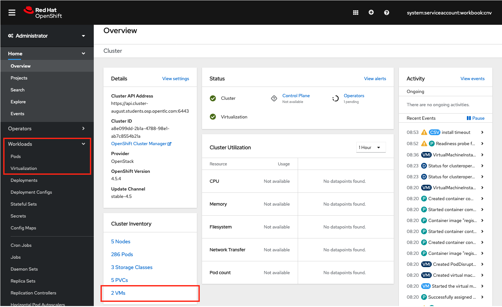

Choose "**Virtualization**" from the "**Workloads**" menu and you will see the remaining running VMs from the labs. Click on the link for the "**centos8-server-nfs**" instance. Here you see some of the features of the instance, such as the IP, OpenShift worker node, OS, and more.

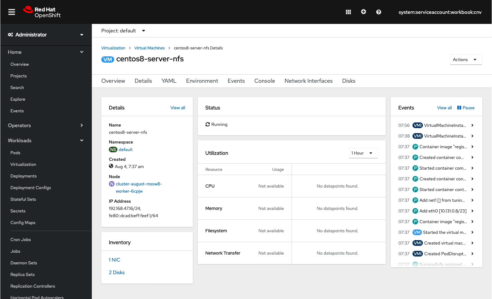

Across the top is a menu allowing you deeper access to administer and access the running VM. 

* Choose `YAML` to view, edit, and reload the template defining this instance. 
* `Consoles` give you access, via both VNC and Serial to the instance's console for easy login. 
* `Events` display, of course, important events for the instance. 
* With `Network Interfaces` we can see the name, model, binding, etc for the instances network connections. 
* Under `Disks` we can see the storage class used and the type of interface. 

Be sure to look at the different entries for different types of virtual machines. You should be able to directly connect the names, values, and information to the services and objects you created before.

But it's not just the VM instances available. OpenShift Virtualization is merely an extension to OpenShift and all the components we created and used for our VMs are part of the OpenShift experience just like they are for pods. On the menu on the left choose "**Networking**" and select "**Services**":

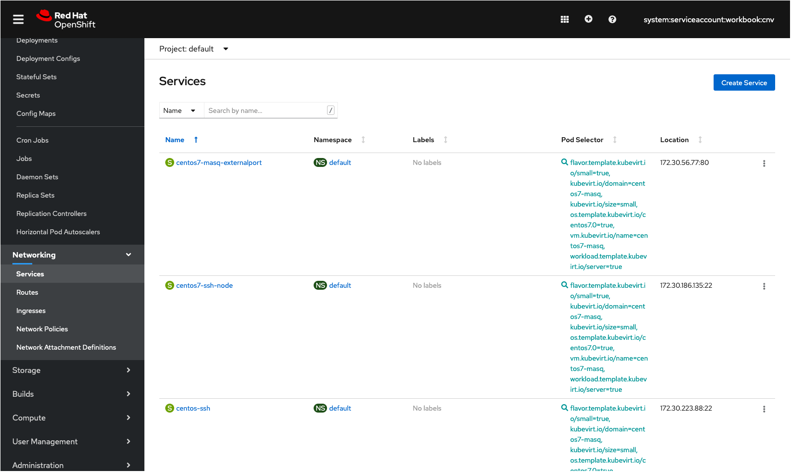

Here you can see the networking services we created for our Centos 7 host for **http**, **ssh**, and  **NodePort SSH**. Try drilling down on the `centos7-masq-externalport` Service. You should see all the features of the service including Cluster IP, port mapping, and routing. From the "**Actions**" menu in the upper right corner you can edit many of these values directly from the UI, just as with a standard OpenShift containerized application! 

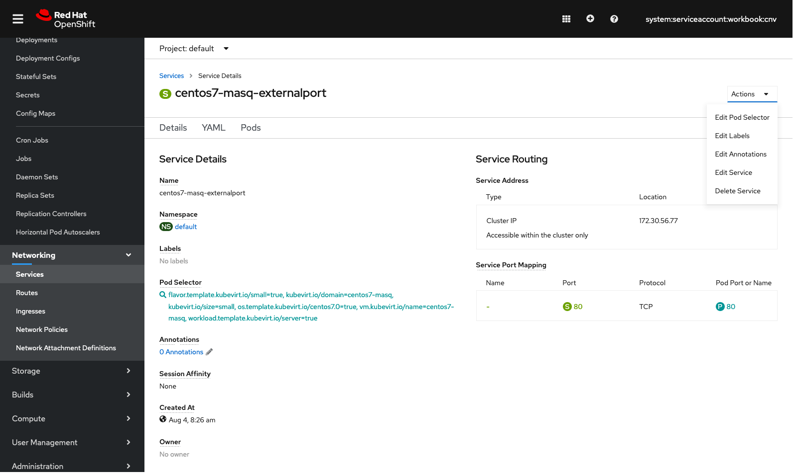

Next click on the `Pods` menu item.

Here we can see the pod that is running the VM instance (the "launcher" pod we learned about previously) as well as the host it is running on:

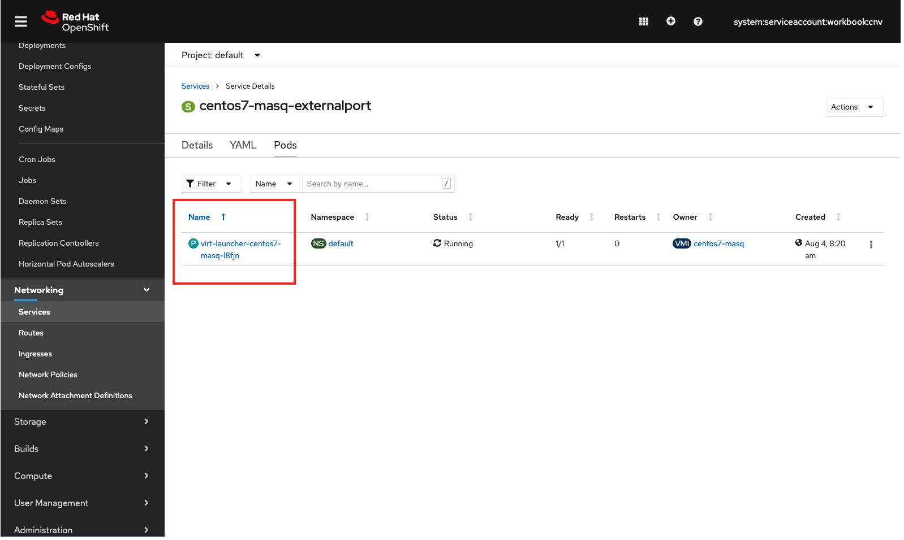

Choose the link for the launcher pod and we can really see the components we built behind the pod. It's important again to note that from here we have access like any other pod in OpenShift. We can use the menu across the top to view the Pod's YAML, Logs, and even access the pod's Terminal (note this is NOT the VM's command line or console, this is for the pod which **runs** the VM; remember when we did this from the CLI?).

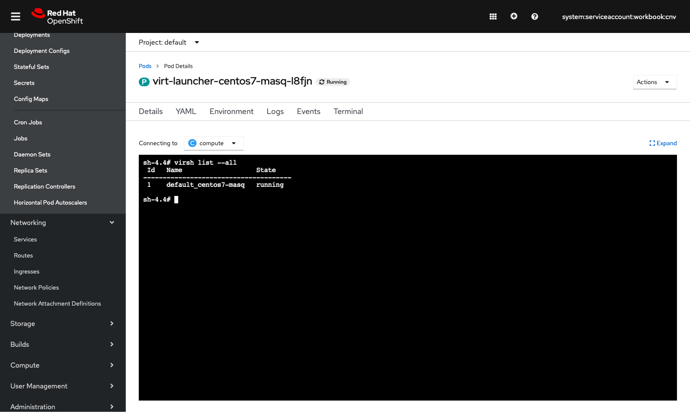

Go back to the **Details** tab and scroll down on this screen to the **Volumes** section. Here we find all the usual pod constructs, such as volumes and disks, and we also see the mounted disk for the VM it's running: `disk-0`. 

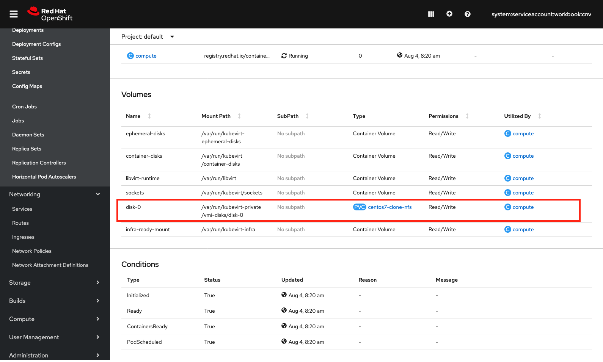

Following on from here, select the link for `disk-0` under the PVC label: 

Here we can see and edit all the features of the PVC we assigned for this pod.

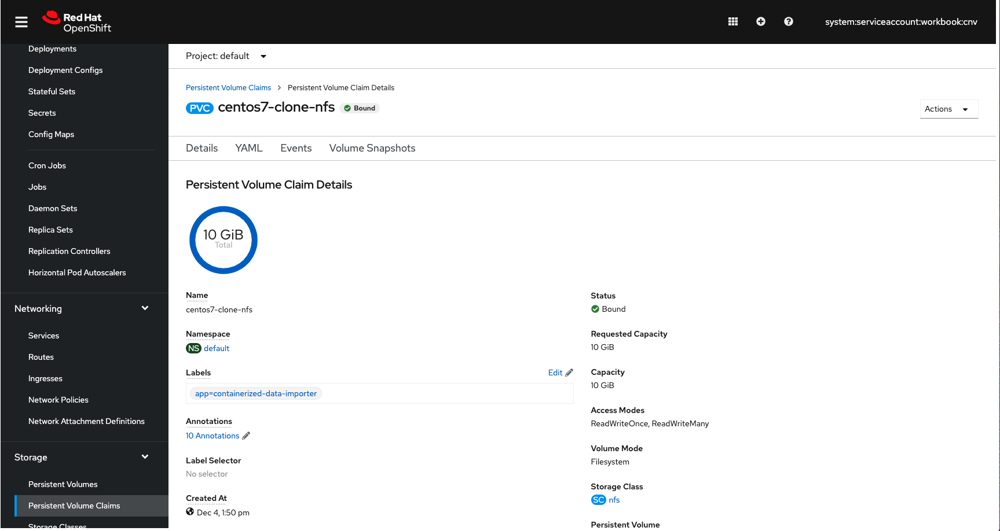

Now, under the "**Storage**" menu on the left, choose "**Persistent Volumes**" and you'll see the storage setup we created previously.

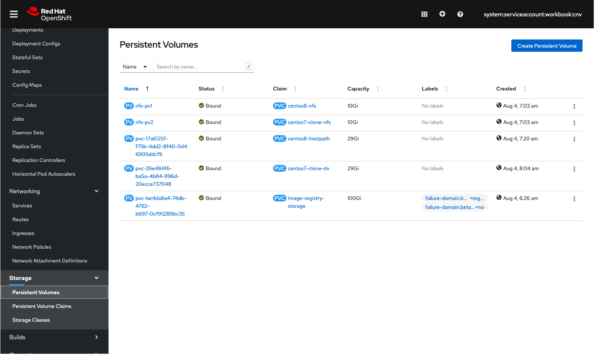

The same is true for all components of our VM's and VMI's from the labs. If you choose any of the storage items from the now-highlighted storage menu on the left you will see. Try choosing "**Storage**" > "**Persistent Volumes**" to show the various PVs we created. Continue to "**Persistent Volume Claims**" and "**Storage Classes**" to complete the picture.

Finally, select "**Networking**" and choose "**Network Attachment Definitions**". There you'll see the `tuning-bridge-fixed` policy we created. 

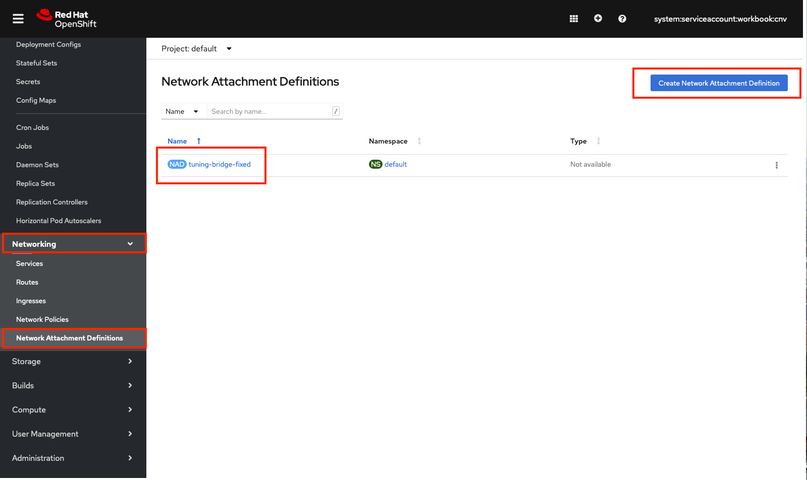

## Preparing to Launch a VM

Now let's launch a Centos VM via the UI using the same components we used via the CLI. 

#### Storage

First, let's create our storage. As before let's create a PVC using CDI to import our OS. However, as you've just seen through our review steps above we do not have any unbound PV's. So let's use the UI to create one.

Go to **"Storage"** -> "**Persistent Volumes**" and choose the "**Create Persistent Volume**" button in the upper right corner:

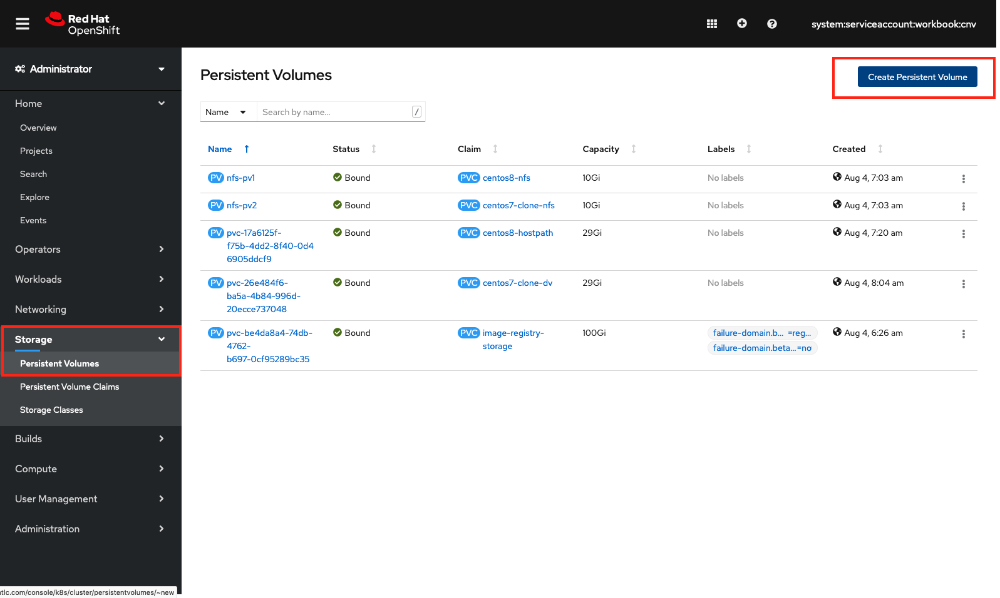

Here there is no fancy wizard to create what we need, but we can easily add the YAML directly via the UI. 

Fortunatly, we have an existing, unused NFS share on our bastion host at the **/mnt/nfs/three** directory. So we can easily create the new PV by adding the following YAML directly into to the editor (**remember to update the content below with your bastion's actual IP**!!)

~~~bash
apiVersion: v1
kind: PersistentVolume
metadata:
  name: nfs-pv3
spec:
  accessModes:
  - ReadWriteOnce
  - ReadWriteMany
  capacity:
    storage: 10Gi
  nfs:
    path: /mnt/nfs/three
    server: 192.168.47.16 <------ CHANGEME
  persistentVolumeReclaimPolicy: Delete
  storageClassName: nfs
  volumeMode: Filesystem
~~~

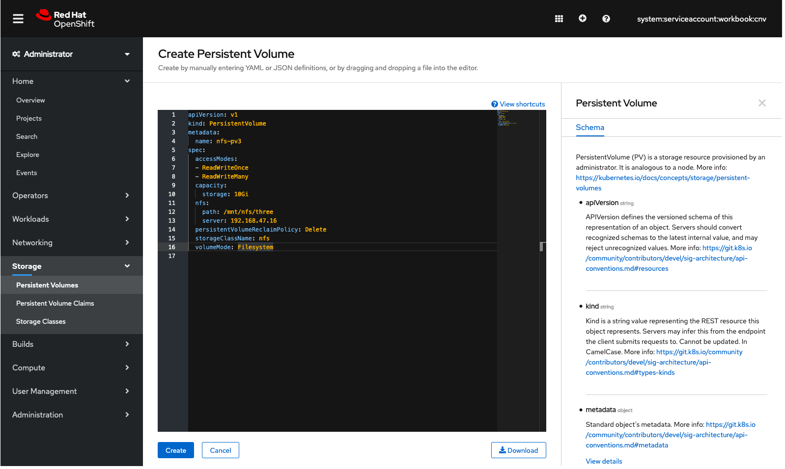

And then select the "**Create**" option.

You now have an unbound volume ready for a PVC utilising CDI. 

Choose "**Storage**" and then "**Persistent Volume Claims**" and select "**Create Persistent Volume Claim** and choose **With Form** from the drop down.

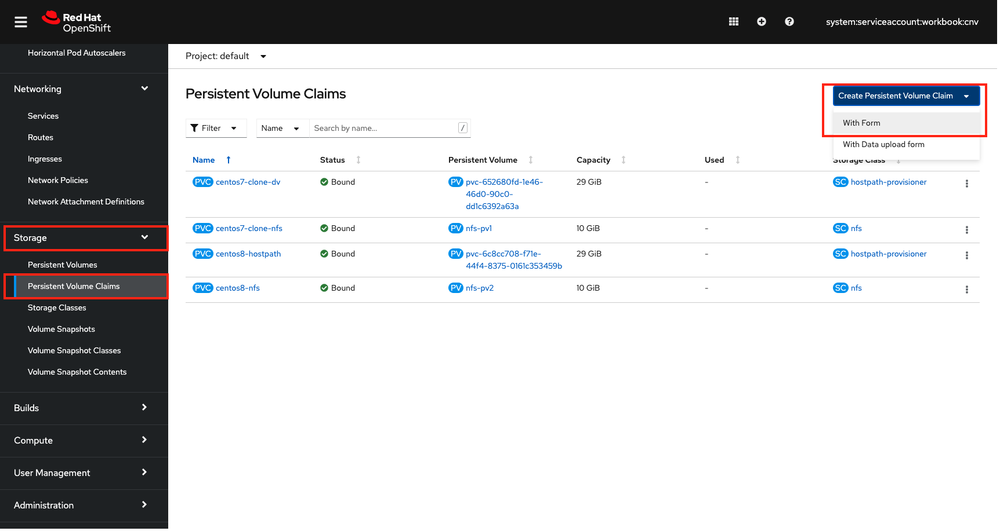

Let's go ahead and enter the details for the PVC directly as YAML. Choose the "**Edit YAML**" option at the top:

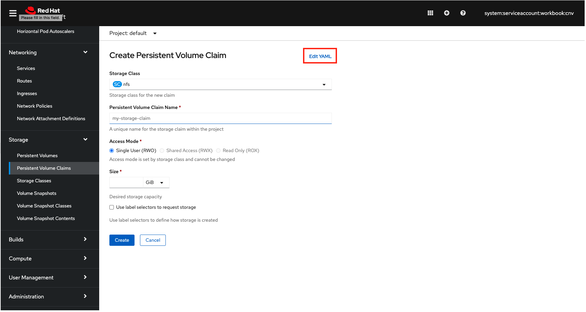
 
And place the details into the editor:

~~~bash
apiVersion: v1
kind: PersistentVolumeClaim
metadata:
  name: "centos7-ui-nfs"
  labels:
    app: containerized-data-importer
  annotations:
    cdi.kubevirt.io/storage.import.endpoint: "https://cloud.centos.org/centos/7/images/CentOS-7-x86_64-GenericCloud.qcow2"
spec:
  volumeMode: Filesystem
  storageClassName: nfs
  accessModes:
  - ReadWriteMany
  resources:
    requests:
      storage: 10Gi
~~~

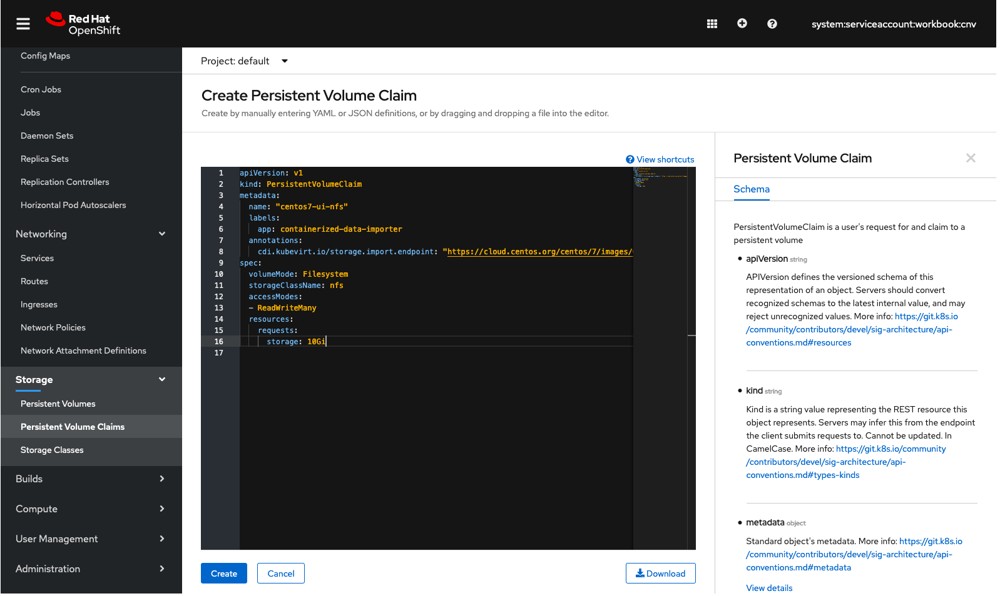

Click "**Create**" to create the PVC and import the OS image.

_Quickly_ select "**Workloads**" -> "**Pods**" and you should see the `importer-centos7-ui-nfs` pod. 

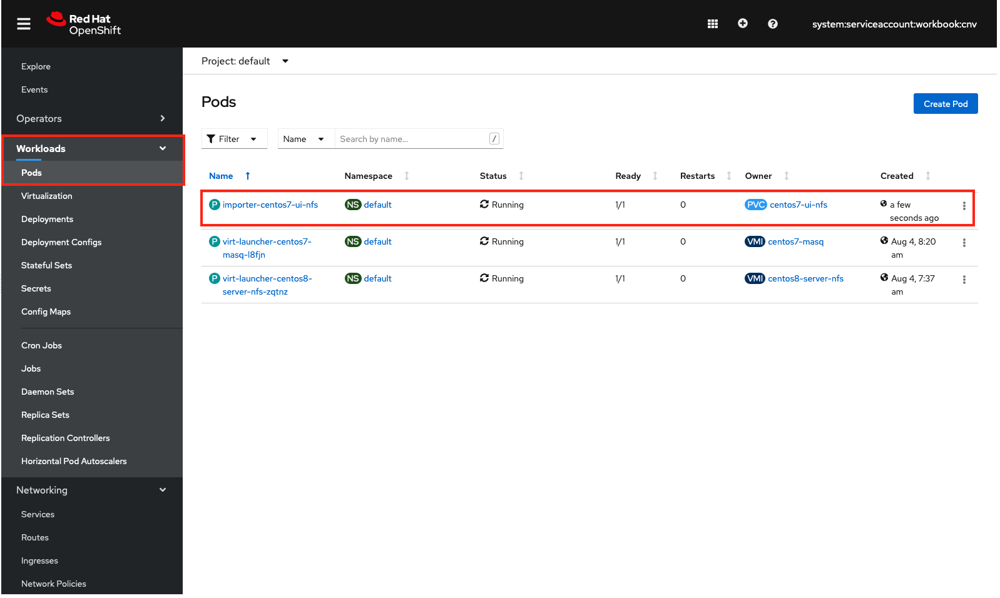

Select it, and from the pods Details page that appears quickly choose the "**Logs**" tab at the top:

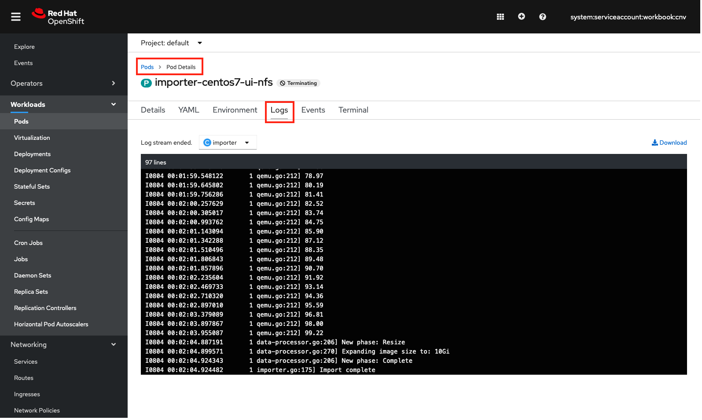

If you were quick enough you'll see the pod import log exactly as you saw it from the CLI. If you missed, the image above will have to do! ;)

### Networking
We will utilize the networking constructs we built in the previous labs, which can be seen under the "**Networking**" menu:

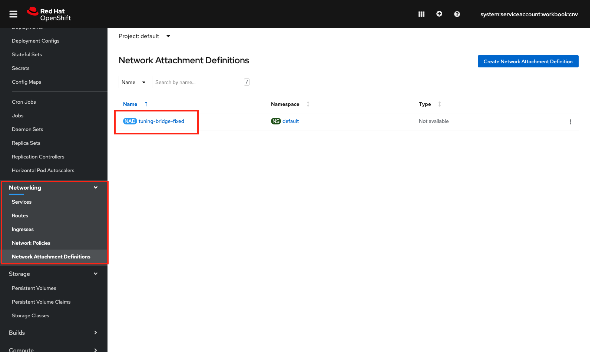

> **NOTE**: Not all functionality is available via the UI.

## Launching the VM

With all the pieces now in place we are ready to create our VM with the UI. 

Go to "**Workloads**" and choose "**Virtualization**". You'll see your running VMs and a big blue "**Create VIrtual Machine**" option. Select the downward-facing arrow on that button and choose "**New with Wizard**"

**Note**> If you don't see your VMs, check you are in the right namespace using the namespace selector at the top of the screen.

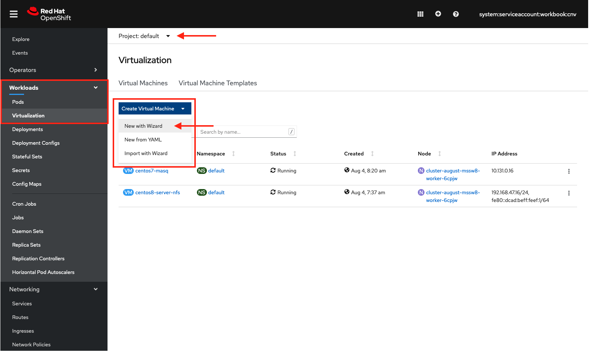

This brings up a an easy to follow wizard to launch the VM:

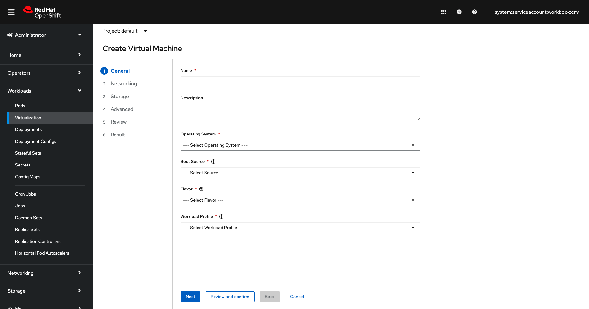

Fill out the **General** page with the following details:

* **Name**: Choose an obvious name, here we just went with "centos7-ui-vm"
* **Description**: Something to help you remember this moment
* **Operating System**: "Red Hat Enterprise Linux 7.0 or higher" is fine for CentOS 7 :)
* **Boot Source**: Choose *Existing PVC (adds disk)* as we are going to select our prepared and imported PVC (we do this in a later screen)
* **Flavor**: Choose "Small" to match our other VMs.
* **Workload Profile**: Choose "Server" to match our other VMs.

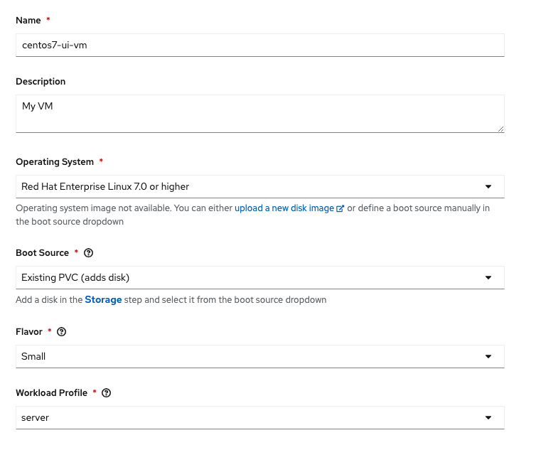

Click **Next**.

Fill out the **Networking** page.

We are again going to use the bridge we created on the workers to access the external network. Choose the three vertical dots next to the nic-0 (ie first) adapater and select **Edit**

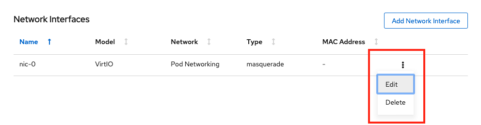

* Leave the **Name** and **Model** as they are.
* Set **Network** to "tuning-bridge-fixed" to use our network policy and access the external network.
* Ensure **Type** is "Bridge"
* Set **MAC Address** to `de:ad:be:ef:00:02` This ensures that things work within RHPDS.

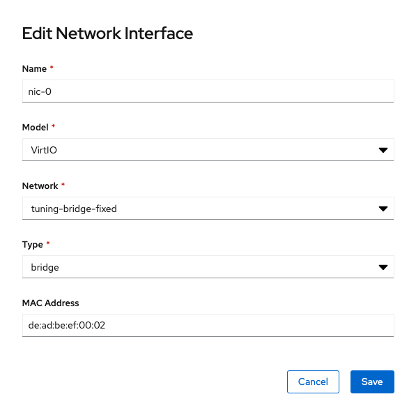

And Click "**Save**" and then "**Next**"

You are now on the **Disks** setup.

Choose "**Add Disk**" and fill out as follows:

* Set **Source** to "Use an existing PVC" so we can use an already created disk (our PVC!)
* Set **Persistent Volume Claim** to the "centos7-ui-nfs" PVC we created and loaded with Centos7!
* Leave **Name** and **Interface** and **Type** as they are

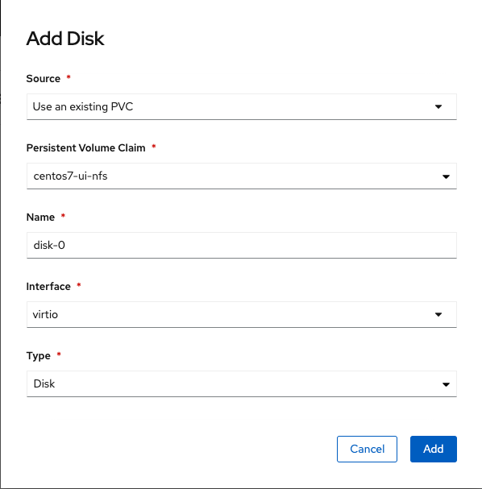

Choose **Add**.

Before clicking **Next** ensure you set the "**Boot Source**" to "disk-0" so we use our OS-filled PVC to boot.

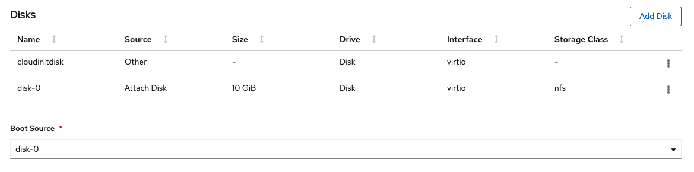

Choose **Next** to move to the "**Advanced**" section.

Here we will set our cloud-init config to run. Choose the "**Custom Script**" radio button and enter the cloud-init details into the box.

To view this config outside of the lab environment go to [https://github.com/RHFieldProductManagement/openshift-virt-labs/tree/rhpds/configs/centos7-ui-vm-cloud-init.txt](https://github.com/RHFieldProductManagement/openshift-virt-labs/tree/rhpds/configs/centos7-ui-vm-cloud-init.txt)

~~~bash
#cloud-config
password: redhat
chpasswd: {expire: False}
ssh_pwauth: 1
write_files:
  - path: /etc/systemd/system/nginx.service
    permissions: ‘0755’
    content: |
        [Unit]
        Description=Nginx Podman container
        Wants=syslog.service
        [Service]
        ExecStart=/usr/bin/podman run --net=host nginxdemos/hello
        ExecStop=/usr/bin/podman stop --all
        [Install]
        WantedBy=multi-user.target
  - content: |
        # hi
        DEVICE=eth0
        HWADDR=de:ad:be:ef:00:02
        ONBOOT=yes
        TYPE=Ethernet
        USERCTL=no
        IPADDR=192.168.47.6
        PREFIX=24
        GATEWAY=192.168.47.1   
        DNS1=150.239.16.11
        DNS2=150.239.16.12
    path:  /etc/sysconfig/network-scripts/ifcfg-eth0
    permissions: '0644'
runcmd:
  - [ systemctl, restart, network ]
  - [ yum, install, -y, podman ]
  - [ systemctl, daemon-reload ]
  - [ systemctl, enable, nginx ]
  - [ systemctl, start, --no-block, nginx ]  
~~~

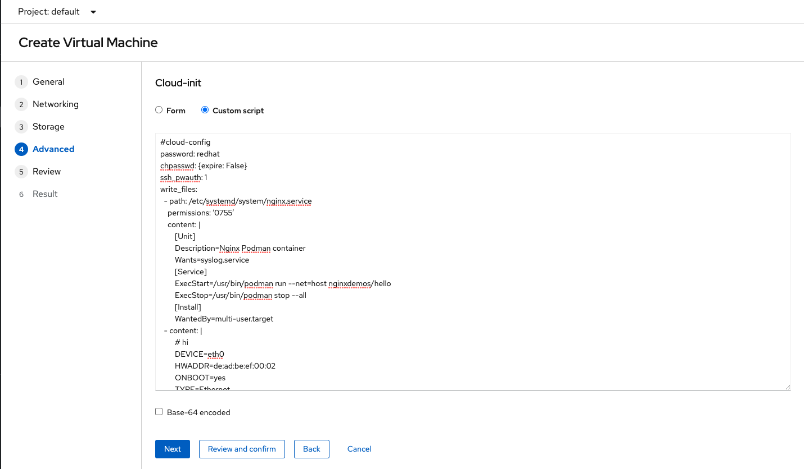

Next select "**Next**" to move to the next screen.

You can now "**Review and confirm your settings**" 

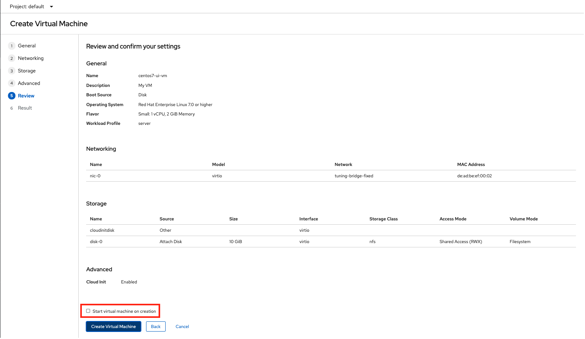

For the moment, leave the "**Start virtual machine on creation**" **_UNTICKED_**. This prevents the VMI from starting.

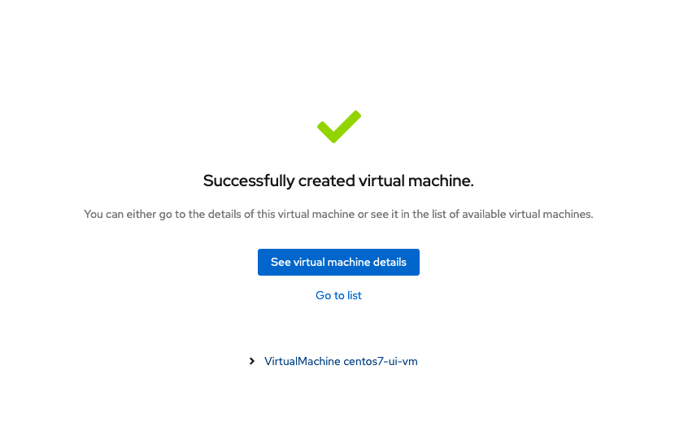

Select "**See virtual machine details**" to review the machine's details.

As a neat reminder of the difference between **vm** and **vmi** go ahead and jump back to the terminal and run `oc get vm` and `oc get vmi` right now:

~~~bash
[~] $ oc get vm
NAME                 AGE    VOLUME
centos7-masq         142m
centos7-ui-vm        72s
centos8-server-nfs   3h4m
[~] $ oc get vmi
NAME                 AGE    PHASE     IP                 NODENAME
centos7-masq         142m   Running   10.131.0.16        cluster-august-mssw8-worker-6cpjw
centos8-server-nfs   3h4m   Running   192.168.47.5/24   cluster-august-mssw8-worker-6cpjw
~~~

If you want now is the time to have a look around the UI before starting the VM!

When ready, go back to the console and under the new VM's "**Details**" page select "**Actions**" -> "**Start Virtual Machine**"

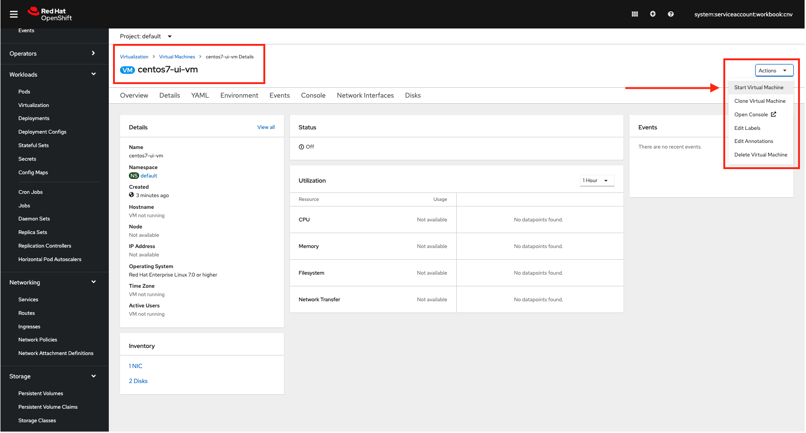

**The VM will start!**

> **NOTE**: It will take 6-7 minutes due to the environmental restrictions in RHPDS. The console will reflect this with the following message as Centos waiys for the NIC to timeout and be configured: `[**    ] A start job is running for LSB: Bri...n networking (1min 3s / 5min 5s)`

You can watch this process from a number of areas, check the "Console" and "Events" tabs for a start.

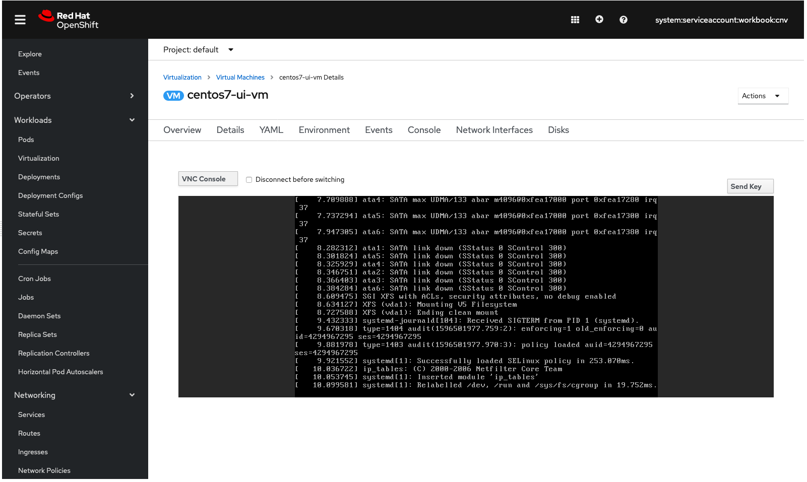

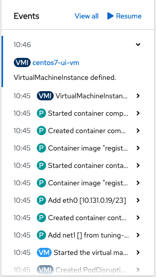

Eventually the VMI is shown as running on the "**Details**" page:

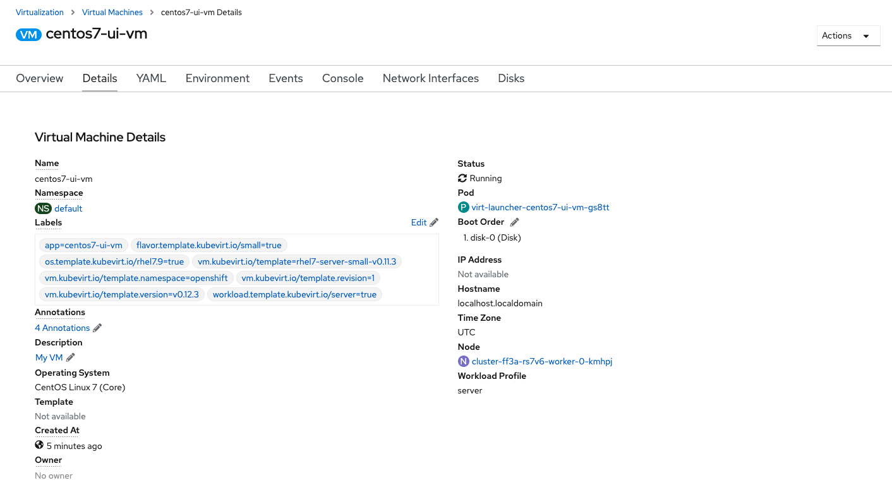

Give it a few minutes more and the node's "public" IP address will report as well:

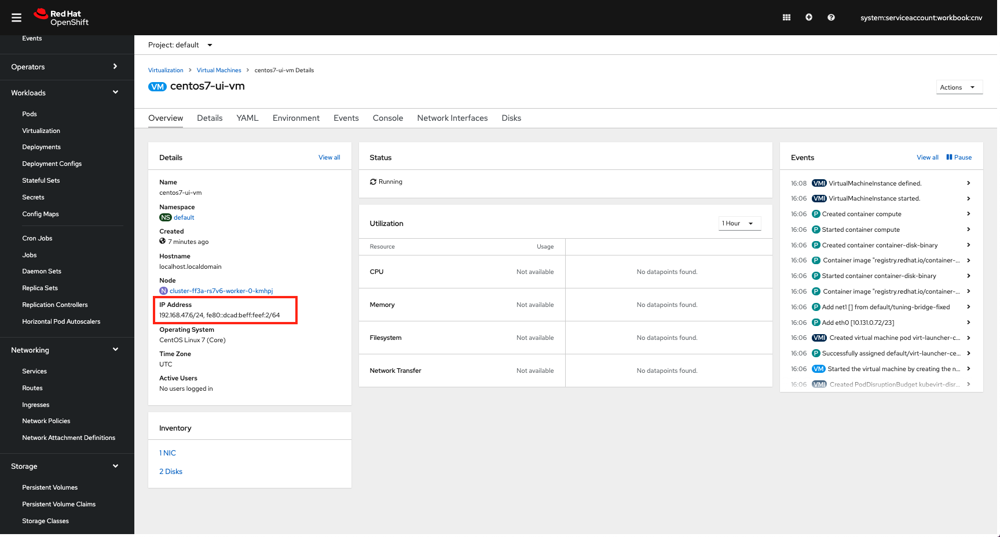

You can now use that to connect to the running NGINX (thanks to cloud-init) via your bastion-connected browser or SSH to the machine from the lab's terminal! (login with centos/redhat as per cloud-init!)

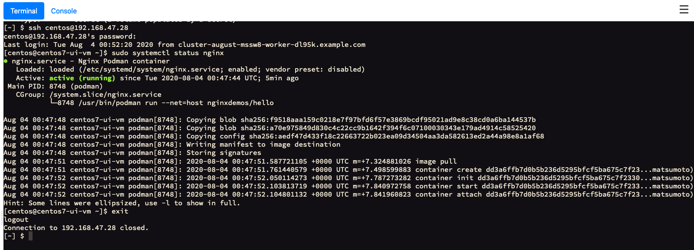

Console access is available via `virtctl` or from the UI directly:

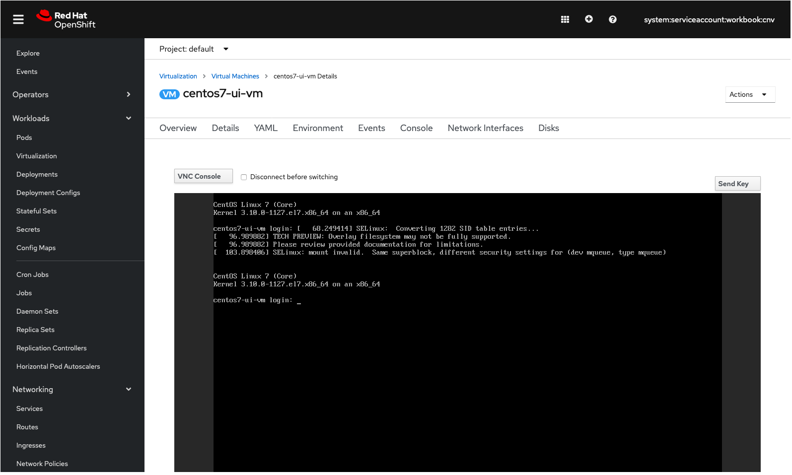

### Want to try more?

Why not try some/all/none of the following?!:

* Create a PV for the /mnt/nfs/four share on your bastion and use it 

* Utilize the URL "Source" option of the VM wizard to import an image (Centos? RHEL? Windows? Your own?).

 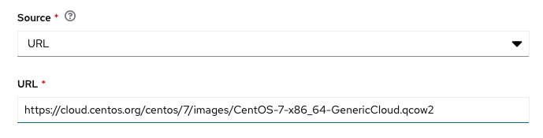
 
* Create a new VM and use OpenShift's native networking options.

 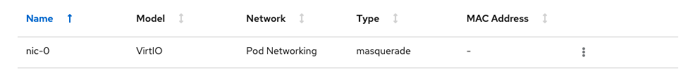
 
* Create services via the UI!

 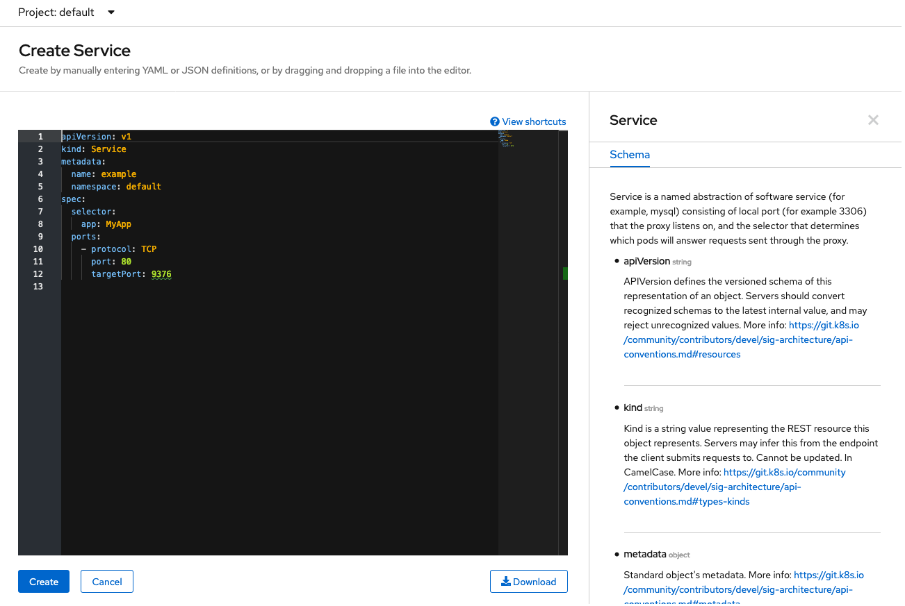
 
* Create Routes via the UI!

 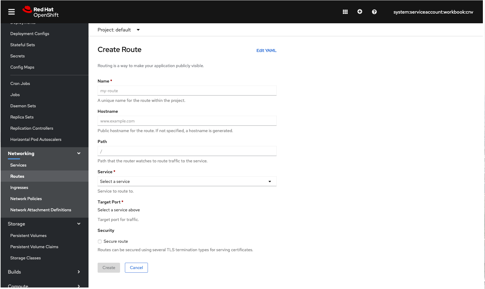

* Create a VM template!

* Check out the [documentation](https://docs.openshift.com/container-platform/4.5/virt/about-virt.html) for more use case ideas!
 
**Your environment has resources to run a few more VMs so have a play and see what you can learn!**

## Thank you!

Thanks for participating in our lab. We hope you found it informative and educational!

As mentioned, if you have found errors or omissions we want to know about them and fix them! Submit your pull requests to the [RHPDS branch](https://github.com/RHFieldProductManagement/openshift-virt-labs/tree/rhpds) or email the team directly (field-engagement@redhat.com) so we can work together!

_Any and all feedback is warmly welcomed and appreciated!_

**Happy Virtualizing** and **Virtualising** from your friends around the world!