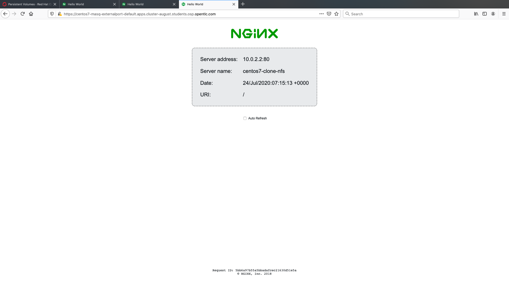
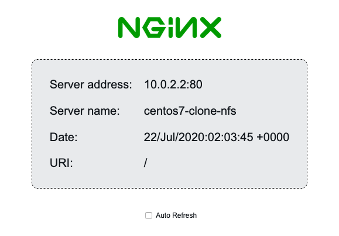

Up to this point we've provisioned our virtual machines on a single bridged network, i.e. just using more traditional networking models. 

However, OpenShift 4.x utilises Multus as the default CNI, which permits the user to attach multiple network interfaces from different delegate CNI's simultaneously. 

One of the models available for OpenShift Virtualization is to provide networking with a combination of attachments, including pod networking, that is, having virtual machines attached to the exact same networks that the container pods are attached to as well. 

This has the added benefit of allowing virtual machines to leverage all of the Kubernetes models for services, load balancers, node ports, and a wide variety of other functions.

Pod networking is also referred to as "masquerade" mode in OpenShift Virtualization, and it can be used to hide a virtual machine’s outgoing traffic behind the pod IP address. Masquerade mode uses Network Address Translation (NAT) to connect virtual machines to the Pod network backend through a Linux bridge. Masquerade mode is the recommended binding method for VM's that need to use (or have access to) the default pod network.

Utilising pod networking rather than the worker's requires the interface to connect using the `masquerade: {}` method and for IPv4 addresses to be allocated via DHCP. We are going to test this with one of the same Centos images (imported into a PVC) which we used in the previous labs. 

In our virtual machine configuration file we do the following:
 
* instruct the machine to use masquerade mode for the interface:

~~~
interfaces:
  - name: nic0				      	            
    model: virtio					              
    masquerade: {}
~~~

* and utilise the existing PVC containing `centos7-clone-nfs` 

~~~bash
volumes:
- name: disk0
  persistentVolumeClaim:
     claimName: centos7-clone-nfs
~~~

So let's go ahead and create a `VirtualMachine` using our existing Centos 7 image via a PVC we created previously. *Look closely, we are using our cloned PVC so we get the benefits of the installed **NGINX** server and ssh configuration!*

~~~bash
$ cat << EOF | oc apply -f -
apiVersion: kubevirt.io/v1alpha3
kind: VirtualMachine
metadata:
  annotations:
    kubevirt.io/latest-observed-api-version: v1alpha3
    kubevirt.io/storage-observed-api-version: v1alpha3
    name.os.template.kubevirt.io/centos7.0: CentOS 7
  name: centos7-masq
  namespace: default
  labels:
    app: centos7-masq
    flavor.template.kubevirt.io/small: 'true'
    os.template.kubevirt.io/centos7.0: 'true'
    vm.kubevirt.io/template: centos7-server-small-v0.7.0
    vm.kubevirt.io/template.namespace: openshift
    vm.kubevirt.io/template.revision: '1'
    vm.kubevirt.io/template.version: v0.9.1
    workload.template.kubevirt.io/server: 'true'
spec:
  running: false
  template:
    metadata:
      creationTimestamp: null
      labels:
        flavor.template.kubevirt.io/small: 'true'
        kubevirt.io/domain: centos7-masq
        kubevirt.io/size: small
        os.template.kubevirt.io/centos7.0: 'true'
        vm.kubevirt.io/name: centos7-masq
        workload.template.kubevirt.io/server: 'true'
    spec:
      domain:
        cpu:
          cores: 1
          sockets: 1
          threads: 1
        devices:
          disks:
            - bootOrder: 1
              disk:
                bus: virtio
              name: disk-0
          interfaces:
            - masquerade: {}
              model: virtio
              name: nic-0
          networkInterfaceMultiqueue: true
          rng: {}
        machine:
          type: pc-q35-rhel8.1.0
        resources:
          requests:
            memory: 2Gi
      evictionStrategy: LiveMigrate
      hostname: centos7-masq
      networks:
        - name: nic-0
          pod: {}
      terminationGracePeriodSeconds: 0
      volumes:
        - name: disk-0
          persistentVolumeClaim:
            claimName: centos7-clone-nfs
EOF
    
virtualmachine.kubevirt.io/centos7-masq created    
~~~

We can see the Virtual Machine Instance is created on the pod network:

~~~bash
$ oc get vmi/centos7-masq
Error from server (NotFound): virtualmachineinstances.kubevirt.io "centos7-masq" not found
~~~

Oops?! What happened? Where is our instance? WHat did we break?

As you'll recall the instance is just the running version of the VM, so let's see what's up with our VM:

~~~bash
$ oc get vm
NAME                 AGE   RUNNING   VOLUME
centos7-masq         29s   false
centos8-server-nfs   20h   true
~~~

Aha! It's not running. Why? Well, look closely at the yaml above and you'll find the following:

~~~bash
  running: false
~~~

It pays to review before cutting and pasting! ;)

Ok let's start the VM using virtctl (we have all the tools!):

~~~bash
$ virtctl start centos7-masq
VM centos7-masq was scheduled to start

$ oc get vm
NAME                 AGE     RUNNING   VOLUME
centos7-masq         3m33s   true
centos8-server-nfs   20h     true

$ oc get vmi/centos7-masq
NAME           AGE   PHASE     IP            NODENAME
centos7-masq   10s   Running   10.131.0.49   cluster-august-lhrd5-worker-mh52l
~~~

But then run it again a few times until you see the IP dissapear (or run a watch):

~~~bash
$ oc get vmi/centos7-masq
NAME           AGE   PHASE     IP    NODENAME
centos7-masq   38s   Running         cluster-august-lhrd5-worker-mh52l
~~~

Oh dear, hat's going on here now? 

Well as before, this is a clone, and the NIC config will have picked up the old MAC address, which is incorrect for the new VMI.

So, as before use we can use `virtctl` to login (cloud-init on the original build will have ensured the login is enabled and this is possible) and remove the `HWADDR` line from the eth0 config:

~~~bash
$ virtctl console centos7-masq
Successfully connected to centos7-masq console. The escape sequence is ^]

CentOS Linux 7 (Core)
Kernel 3.10.0-1127.el7.x86_64 on an x86_64

centos7-clone-nfs login: centos
Password:
Last login: Wed Jul 22 01:36:32 on ttyS0
[centos@centos7-clone-nfs ~]$ sudo vi /etc/sysconfig/network-scripts/ifcfg-eth0

[centos@centos7-clone-nfs ~]$ sudo ifup eth0

Determining IP information for eth0... done.

[centos@centos7-clone-nfs ~]$ ip a
1: lo: <LOOPBACK,UP,LOWER_UP> mtu 65536 qdisc noqueue state UNKNOWN group default qlen 1000
    link/loopback 00:00:00:00:00:00 brd 00:00:00:00:00:00
    inet 127.0.0.1/8 scope host lo
       valid_lft forever preferred_lft forever
    inet6 ::1/128 scope host
       valid_lft forever preferred_lft forever
2: eth0: <BROADCAST,MULTICAST,UP,LOWER_UP> mtu 1450 qdisc pfifo_fast state UP group default qlen 1000
    link/ether 02:00:00:97:cd:40 brd ff:ff:ff:ff:ff:ff
    inet 10.0.2.2/24 brd 10.0.2.255 scope global dynamic eth0
       valid_lft 86313598sec preferred_lft 86313598sec
    inet6 fe80::ff:fe97:cd40/64 scope link
       valid_lft forever preferred_lft forever

[centos@centos7-clone-nfs ~]$ exit
logout

CentOS Linux 7 (Core)
Kernel 3.10.0-1127.el7.x86_64 on an x86_64

centos7-clone-nfs login:

(ctrl-]) to get back to CLI.
~~~ 

So, we did it. Let's look for the IP (be patient, it will take a few moments)

~~~bash
$ oc get vmi
NAME                 AGE     PHASE     IP                 NODENAME
centos7-masq         2m35s   Running                      cluster-august-lhrd5-worker-mh52l
centos8-server-nfs   97m     Running   192.168.47.34/24   cluster-august-lhrd5-worker-6w624

$ oc get vmi
NAME                 AGE     PHASE     IP                 NODENAME
centos7-masq         2m47s   Running   10.0.2.2/24        cluster-august-lhrd5-worker-mh52l
centos8-server-nfs   97m     Running   192.168.47.34/24   cluster-august-lhrd5-worker-6w624
~~~

Except wait a second ... that's not the IP we saw before.

It has changed to **10.0.2.2**. 

*Why is this? What's going on?*

Well if you remember correctly we used the cloned Centos image which has a qemu-guest-agent installed which can report on the IP assigned *to the host's NIC*. 

But when we use a `masquerade{}` deployment we are, of course, **not** interested in the IP assigned to the host. In fact, we are using this so we can use a private, non-routable range and "hide" behind our masqueraded range (the 10. range). But the agent is trying to be helpful and is telling OpenShift the IP it *thinks* we want and the IP it knows how to give: the IP *on* the hosts NIC. Nice agent, but, sorry, no we don't care.

But they're both there of course.

If you recall, all VMs are managed by pods, and the pod manages the networking. So we can ask the pod associated with the VM for the actual IP ranges being managed here. It's easy ... first find the name of the `launcher` pod associated with this instance:

~~~bash
$ oc get pods | grep centos7
virt-launcher-centos7-masq-7flv8         1/1     Running     0          7m56s
~~~

Then let's ask check with the *pod* for the actual IPs it is managing for the VM:

~~~bash
$ oc describe pod/virt-launcher-centos7-masq-r2gk4| grep -A 11 networks-status
              k8s.v1.cni.cncf.io/networks-status:
                [{
                    "name": "openshift-sdn",
                    "interface": "eth0",
                    "ips": [
                        "10.131.0.49"
                    ],
                    "default": true,
                    "dns": {}
                }]
              kubevirt.io/domain: centos7-masq
              traffic.sidecar.istio.io/kubevirtInterfaces: k6t-eth0
~~~

There it is, `10.131.0.49` is "back"!

And again, if you ask OpenShift for the IP, the qemu-guest-agent supplies the *actual* IP that the VM is set to, just like it's designed to do.

~~~bash
$ oc get vmi
NAME                 AGE     PHASE     IP                 NODENAME
centos7-masq         7m27s   Running   10.0.2.2/24        cluster-august-lhrd5-worker-mh52l
centos8-server-nfs   102m    Running   192.168.47.34/24   cluster-august-lhrd5-worker-6w624
~~~

## Exposing the VM to the outside world

In this step we're going to expose our VM to the outside world using OpenShift/Kubernetes networking constructs, namely services and routes. To do this we will again use the OpenShift virtualisation `virtctl` tool so we can set up the routes for our services. 

As a reminder, the `virtctl` tool is the CLI-based utility that allows you to interact with an OpenShift Virtualization install which bridges some of the gaps between the virtualisation world and the world that Kubernetes was designed for. 

For example, the `virtctl` tool provides the capability of managing the lifecycle of virtual machines (starting, stopping, restarting, etc), providing access to the virtual consoles, uploading virtual machine images, as well as interfacing with Kubernetes constructs such as services, routes, and alike.

If you remember, our Centos image has NGINX running on port 80, let's use the `virtctl` utility to expose the virtual machine instance on that port:

~~~bash
$ virtctl expose virtualmachineinstance centos7-masq --name centos7-masq-externalport --port 80
Service centos7-masq-externalport successfully exposed for virtualmachineinstance centos7-masq

$ oc get svc/centos7-masq-externalport
NAME                        TYPE        CLUSTER-IP       EXTERNAL-IP   PORT(S)   AGE
centos7-masq-externalport   ClusterIP   172.30.235.215   <none>        80/TCP    18s
~~~

Next we create a route for our service and in this case we are using the `edge` designator. This creates a route that uses edge TLS termination provided by the OpenShift cluster.:

~~~bash
$ oc create route edge --service=centos7-masq-externalport
route.route.openshift.io/centos7-masq-externalport created
~~~

And view the route:

~~~bash
$ oc get routes
NAME                        HOST/PORT                                                                        PATH   SERVICES                    PORT    TERMINATION   WILDCARD
centos7-masq-externalport   centos7-masq-externalport-default.apps.cluster-august.students.osp.opentlc.com          centos7-masq-externalport   <all>   edge          Non
~~~

You can now visit that endpoint via an HTTPS connection (ie, in this example it is https://centos7-masq-externalport-default.apps.cluster-august.students.osp.opentlc.com) in a browser and should find the NGINX server from your Centos based VM running behind an TLS encrypted endpoint.

> **NOTE**: If you get an "Application is not available" message, make sure that you're accessing the route with **https** - the router performs TLS termination for us, and therefore there's not actually anything listening on port 80 on the outside world, it just forwards 443 (OpenShift ingress) -> 80 (pod).

As you can see, NGINX is there showing the cloned name (of course) and we can see the internal, host-assigned, IP.

### Via the NodePort service
In this step we're going to further expose our server, but via SSH, and not the web server port. To do that we'll use a `NodePort`, which exposes the service on the underlying worker node's IP, but on a custom port. Let's create a new service via NodePort; in this case we name it `centos7-ssh-node`:

~~~bash
$ virtctl expose virtualmachineinstance centos7-masq --name centos7-ssh-node --type NodePort --port 22
Service centos7-ssh-node successfully exposed for virtualmachineinstance centos7-masq
~~~

And check which port has been allocated:

~~~bash
$ oc get svc/centos7-ssh-node
NAME               TYPE       CLUSTER-IP       EXTERNAL-IP   PORT(S)        AGE
centos7-ssh-node   NodePort   172.30.141.173   <none>        22:32101/TCP   11s
~~~

In this case our server is accessible on port **32101**. Review which node has been deployed to:

~~~bash
$ oc get vmi/centos7-masq
NAME           AGE   PHASE     IP            NODENAME
centos7-masq   13m   Running   10.0.2.2/24   cluster-august-lhrd5-worker-mh52l
~~~

Now that we know which worker it's on we can try SSH'ing to the VM via the mapped port on the underlying host's `NodePort`:

~~~bash
$ ssh centos@cluster-august-lhrd5-worker-mh52l -p 32101
(...)

centos@cluster-august-lhrd5-worker-mh52l's password:
Last login: Fri Jul 24 07:06:06 2020

[centos@centos7-clone-nfs ~]$

[centos@centos7-clone-nfs ~]$ logout
Connection to cluster-august-lhrd5-worker-mh52l closed
~~~

But you know what's even better?

NodePort services are available on *every* host, i.e. even though the VM is running on a specific host, we can ssh to any another worker, on the same port, and reach it. Try it.

~~~bash
$ ssh centos@cluster-august-lhrd5-worker-6w624 -p 32101

(...)

centos@cluster-august-lhrd5-worker-6w624's password:
Last login: Fri Jul 24 07:20:26 2020 from 10.131.0.1

[centos@centos7-clone-nfs ~]$

~~~

Be sure to logout of the VM before proceeding:

~~~bash
centos@centos7-clone-nfs ~]$ logout
Connection to luster-august-lhrd5-worker-6w624 closed.

[cloud-user@bastion ~]$

~~~

### Via the cluster IP

We can also create a service to expose port 22 directly on the cluster so we won't need an alternate port. As before expose an ssh service; in this case we name it `centos-ssh`:

~~~bash
$ virtctl expose virtualmachineinstance centos7-masq --name centos-ssh --port 22
Service centos-ssh successfully exposed for virtualmachineinstance centos7-masq
~~~

We can now see it in our `oc get svc` output:

~~~bash
$ oc get svc
NAME                        TYPE           CLUSTER-IP       EXTERNAL-IP                            PORT(S)        AGE
centos-ssh                  ClusterIP      172.30.232.4     <none>                                 22/TCP         7s
centos7-masq-externalport   ClusterIP      172.30.235.215   <none>                                 80/TCP         10m
centos7-ssh-node            NodePort       172.30.141.173   <none>                                 22:32101/TCP   5m26s
kubernetes                  ClusterIP      172.30.0.1       <none>                                 443/TCP        6h25m
openshift                   ExternalName   <none>           kubernetes.default.svc.cluster.local   <none>         6h2m
~~~

We can then connect directly to that `CLUSTER-IP` listed for the service (in this case `centos-ssh`, so `172.30.232.4`) directly on port 22 from the worker node itself.

So, find the node ...

~~~bash
$ oc get vmi
NAME                 AGE    PHASE     IP                 NODENAME
centos7-masq         19m    Running   10.0.2.2/24        cluster-august-lhrd5-worker-mh52l
centos8-server-nfs   113m   Running   192.168.47.34/24   cluster-august-lhrd5-worker-6w624
~~~

And open a debug pod on it.

~~~bash
$ oc debug node/cluster-august-lhrd5-worker-mh52l
Starting pod/cluster-august-lhrd5-worker-mh52l-debug ...
To use host binaries, run `chroot /host`
Pod IP: 10.0.0.33
If you don't see a command prompt, try pressing enter.
sh-4.2# chroot /host
sh-4.4#
~~~

And ssh to the `CLUSTER-IP` once on the host (via the debug pod):

~~~bash
sh-4.4# ssh centos@172.30.232.4
(...)
centos@172.30.232.4's password:
Last login: Fri Jul 24 07:21:36 2020 from 10.128.2.1
[centos@centos7-clone-nfs ~]$

~~~

Success!

Don't forget to 

* logout of the centos vm
* exit the chroot'd shell
* exit the debug pod

~~~bash
[centos@centos7-clone-nfs ~]$ logout
Connection to 172.30.97.158 closed.
sh-4.4# exit
exit
sh-4.2# exit
exit

Removing debug pod ...
[cloud-user@bastion ~]$
~~~

